### Booleans

## Hard Ops and Booleans

**[Booltool](https://blenderartists.org/forum/showthread.php?336498-BoolTool-0-2&p=2659836&viewfull=1#post2659836) is no longer required** The hotkeys I once used booltool for have been added into the core of hard ops and supports the drawing and interconnecting systems as a result. This allows for deeper interaction and and possible expansions on the workflow independent of changes outside of our control.

The hotkeys are as follows:

- ctrl + numpad minus (difference boolean)
- ctrl + numpad plus (union boolean)
- ctrl + numpad slash (slash boolean)

To demonstrate union and difference.

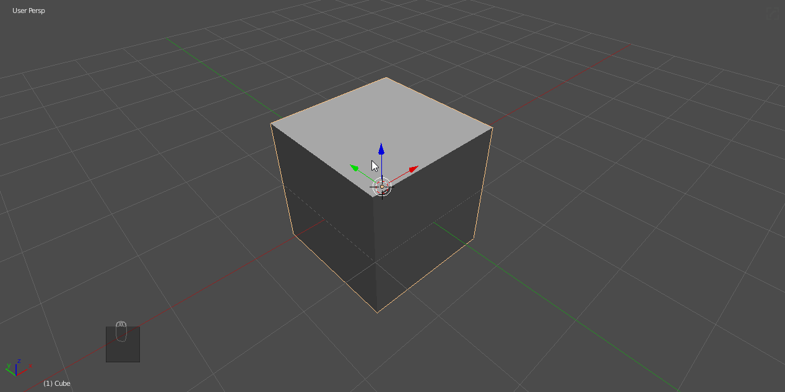

To demonstrate slash.

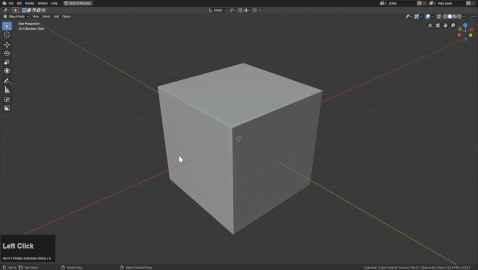

As the gif shows you can also use [hopsTool](hopsTool.md) w/ 2 object selection to setup booleans as well.

> Slash is also in the Q menu when 2 objects are selected.

So while we support booltool and will respect it if enabled, the HOPS boolean system will also set up [drawing](hud.md) and use our [systems](sstatus.md).

---

## Using Booleans in Hard Ops

# hotkeys

With 2 or more objects the following hotkeys apply.

- ctrl + numpad minus (difference boolean)
- ctrl + numpad plus (union boolean)
- ctrl + numpad slash (slash boolean)

# Q menu

With 2 or more objects the Q menu will show an option for booleans.

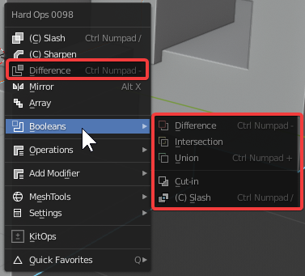

> I generally use the hotkeys but this is added for additional conveninece.

# Shift + Q Pie menu

With 2 or more objects the shift + Q menu will show options for booleans.

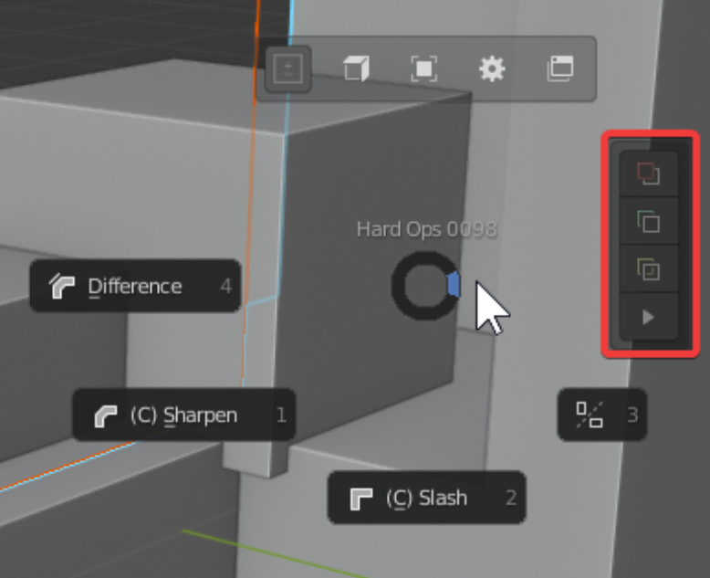

---

## boolshape

When an object is used as a boolean the following things happen:
  - object is converted into a wire
  - object receives the sstatus: boolshape which affects the Q menu

This means the object has a special Q menu with options for bevel, solidify and array.
To demonstrate them all at once.

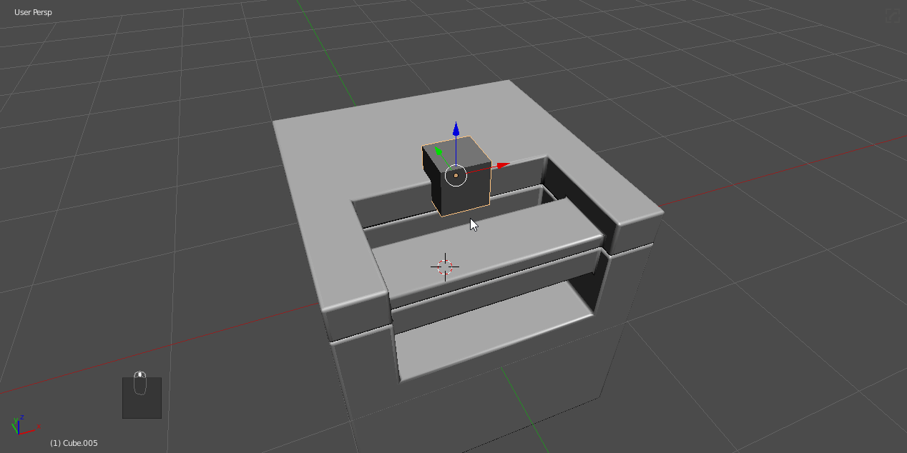

When the logo is red the object is a boolshape. To reset a boolshape just reset the sstatus and convert back into solid in the [settings](settings.md) submenu.

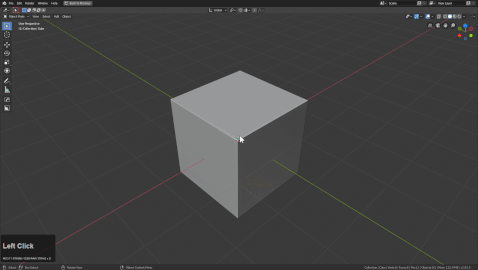

---

## Material Cutting

With 008 there came the ability to do material cutting. For this you will need materials with viewport colors in order to see visually.

**(CTRL + ~)** Brings up the [Hard Ops Helper](helper.md)

On the material tab at the bottom is a cut material area.
Requires object to be selected of course.

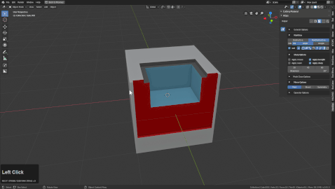

It is also in the N panel.

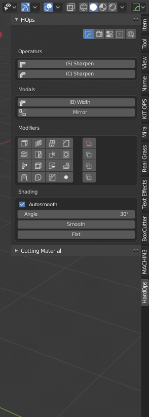

To explain what the options mean:

- All - lists all materials in scene
- Object - lists all material on the object already (never used)

- material list - lists materials
- force material button - this is on by default. It forces the material into a new indice for the boolean operation (never disabled)

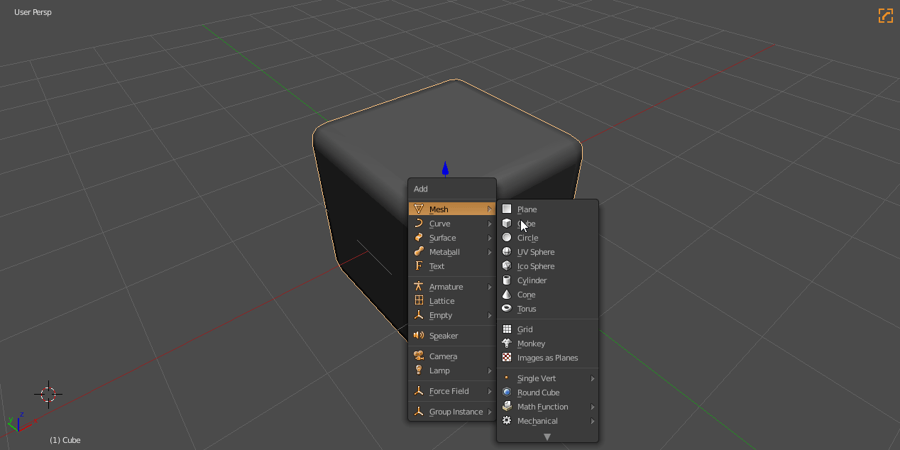

In the above example I used the N panel to set up the cutting material.

Material slicing is also supported.

This can come in handy for performing material cuts as a finishing step for detailing and using materials to trim models.

---

# Backstory: [Booltool](https://blenderartists.org/forum/showthread.php?336498-BoolTool-0-2&p=2659836&viewfull=1#post2659836)

Before [booltool](https://github.com/vitorbalbio/code/tree/master/BoolTool) existed, adding a boolean to a mesh was similar to the below example.

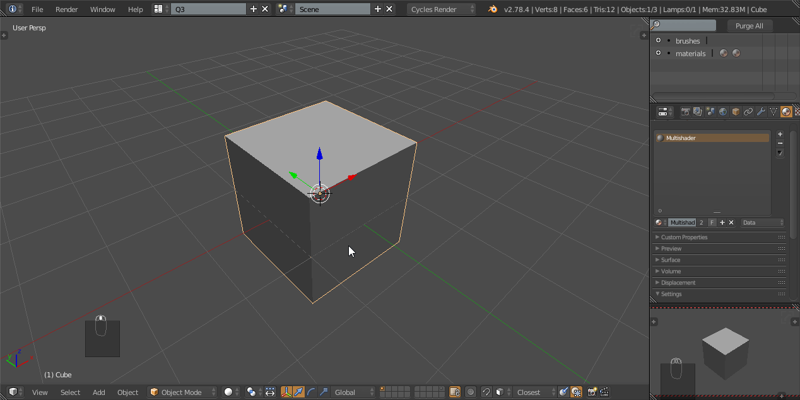

When [Booltool](https://blenderartists.org/forum/showthread.php?336498-BoolTool-0-2&p=2659836&viewfull=1#post2659836) first came out it caused an explosion of booleans onto the scene. They always existed but there never was an approach to make them so applicable.

> I mention the 0.2 version because it was the last update by original creator vitorbalbio. 0.3 and beyond is now handled by a different person so therefore the tool is different now.

In my personal workflow it introduced the ability use the hotkeys:

- ctrl + numpad minus (difference boolean)
- ctrl + numpad plus (union boolean)

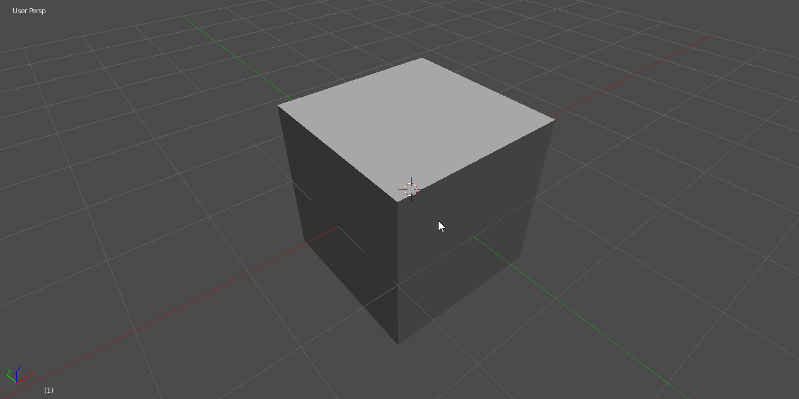

I used booltool for the longest time in this state without expansion or advancement. I especially used this in conjunction with edge split which made animation a nightmare. However this was the workflow at the time.

It goes without saying booltool had many other features worth checking out but the subtractive behavior was my main focus. I still loved what this tool brought to the table and it also opened my eyes to having mirroring and other tools have the same simplistic behavior.

---
