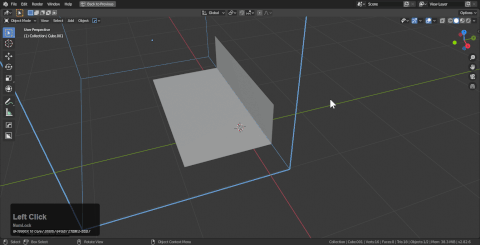
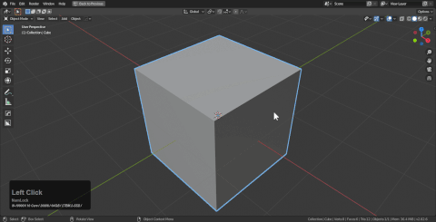
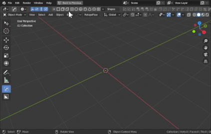

____

# Boolean Tips

> These tips are intended to help make the best out of your experience.

We intend for users to enjoy our tool and have an nice experience. [If you are experiencing issues.](issues.md) [***Please tell us.***](contact.md)

We would prefer to discuss and help solve it before you frustrate yourself. Great care and effort has been taken into making hops a community experience with many on hand capable of assisting quickly and proving help when you need it. A single mind can do so much but a collection of minds is infinite. I sleep 3 hours a night to make sure the boxes are always cut with only the finest red.

> Bugs happen and issues will occur. Our work is no where close to done. But our attempts allow people to get father and farther with each attempt. When something odd happens the best thing to do is:

- gather awareness (figure out what happened in the scene)

  - you have outliner / modifier stack to use as clues to figure out what happened

  - users use the tools much differently than ourselves which can find more unusual cases

  - for example if I cut and it doesn't work out I will undo and watch the mod stack the next time to see what happens exactly

- attempt the operation again and contemplate the below rules as possible reasons of failure

  - using booleans with non manifold meshes will create holes. That is not something we can solve. But you using the program can.

  - by not cutting with non manifold meshes.

- [report the issue to us.](issues.md) [But knowing why they happen help detail the issue better](contact.md)

- utilize the community resources if you are new to 3d and our tools. Make friends. Don't be alone.

- when a boolean fails... ask why? A boolean has no reason to fail unless the case given was a failure.

  - grab that cutter and move it around make sure you didn't hotline.

  - check the normals and make sure it wasnt flipped inside out.

  - see if its on the right side of the mirror

  - make sure sort didnt break the model. Its a work in progress after all...

Case in point. Issues happen. The purpose of this page is to make you more proactive in problem solving. Problems will darn sure happen but its our problem when it stops your project with a showstopper. Showstoppers require patches and updates but technical issues require supplemental understanding to resolve.

____

## always overshoot the mesh

when cutting the boolean must be in a clear area. The more geo you have in the cut area, the harder it can be to make the boolean connect without issue.

"Hotlining" refers to a case where a boolean mesh connects precisely with a vert or edge. This will cause issues due to coplanar merging of boolean geometry not being a thing.

Cad or surface modelers might be used to the flushed behavior of booleans in cad but in 3d polygons, the rules are different.

You could hotline in a second if you wanted to. But it should definitely be avoided.

Meshes can be fickle and with booleans they can be even more fickle. We guarantee no success but I sincerely feel the below tips will make it easier. The below gif shows that mere atoms can be the difference between success and failure but being aware of this limitation and working around it would empower you to be more proactive with failure and progressing without failure.

> Bools will fail but we will roll with the punches.

## check that face orientation

Alt + V >> Face Orientation

Face orientation is a troubleshooting tool to me. When it was added to 2.8 I immediately saw the potential.

Having flipped normals can cause boolean issues and make booleans more difficult than they need to be. This can also make boxcutter irritated and function oddly.

> Applying scale can sometimes cause strangeness.

## scrolls are your friend

The first scroll was a random idea but now scrolling via modals have become crucial for troubleshooting.

> When things go wrong. You get in there and you troubleshoot. It is the only way forward... With each cut solved your understanding of booleans will be deeper and you will be able to work more efficiently with less issues.

LMB - bool scroll (cycles boolean shapes)

If you need a boolshape associated with the selection this is the goto tool. I will sometimes cut and the cut doesn't work out. Then by using this and scrolling back to get the last shape then clicking I am able to rapidly modify shapes and figure out where they went wrong. I would be a liar to say issues don't happen. But we have done our best to put the right tools at your fingertip to keep things running fluidly.

Shift - modifier scroll (scrolls modifiers additively one by one in a stack)

When dealing with modifiers a section of the brain must be allocated to thinking about that stack. We attempted to be that brain with sort. But we still need your awareness when it comes to the stack. By scrolling modifiers users are able to quickly see how the stack got the mesh to its current state. We can't roll undo history so this is the closest thing. This feature has proven to be essential for troubleshooting modifier non destructive workflows.

Ctrl - toggle modifiers

Sometimes you need to just turn all the modifiers off and see the true mesh. I don't use this often. But it exists for the times when it is needed. I like to duplicate things and alter their order to make duplicates that I then apply and move around. Kinda weird to work in this fashion but I want to emphasize this is the functionality and flexibility we aim for.

Scrolls exist at various places in the menu. Initially we had quite a few scrolls but now we seek to consolidate but for those who have a favorite scroll they remain standalone as well so they can be right clicked added to favorites if needed for a specific use.

## do not bisect mirror with booleans... maybe ever

A common mistake is using the bisect mirror method with booleans. This results in a non manifold mesh that will have issues if an object is cut near a junction point.

> DO NOT USE BISECT WITH BOOLEANS... EVER

When bisect is used things will look fine but as you work holes will appear due to breaking the rule of manifold meshes. As I cut near the junction area it is more obvious.

It is easy to solve the situation if this mistake is made.
- apply the first mirror modifier
- add a ***modifier*** mirror modifier

For mirror to work in the stack being sorted it has to mirror a manifold mesh. The classic bisection method was from 2.79- era and remains for "classic workflows". Modifier mirror can be odd getting used to but the stability and predictability of it in use it through the roof.

## work a box . at least once.

Luvin boxes is more than a meme to us. It's a perfect control situation to test cases without the complexity of scene management etc.
Boxes are nothing more than just a way to pop your knuckles. Preparing you for the more complex battles that lie ahead. A common mistake is to take the toolkit directly into a project without a consideration of all the systems at play.

HardOps was intended to show users the best option at the right time and help them get started faster but before that. Try looking at some of the options enabled. Workflow options can be accessed via the ctrl + ~ or the N panel of the 3d view in the HOPS tab.

[If you are not aware of sort or intend to use it, I do not recommend using it.](sorting.md) Otherwise we will make corrections to things you may not want corrected in the mod stack.

have.fun

I want people taking their knowledge [far past boxes](https://www.pinterest.com/masterxeon1001/hard-ops-users/) but let's make sure you know the fundamentals of workflow.

## always have a manifold mesh

Mirror on alt + X offers multiple mirror options.

***Modifier*** is recommended for boolean workflows.

A common mistake is using bisect. This was our only choice back in 2.79 but the new modifier system has changed things. Below is an example of using bisect and having issues with booleans near the middle point. ***Do not use bisect with boolean***

Using modifier as mirror is an immense improvement upon modelling and using booleans. Notice in the below example I am able to apply my bisect mirror and add a subsequent mirror utilizing modifier to get the intended result.

Booleans require manifold geometry. This is a rule and theres no way around it but because it is a rule, it can be counted on for predictability. As in ***I know*** (from experience) cutting on non manifold geometry will make holes. Personally I utilize those limitations into workflows as well as seen below.

Modifier mirror can be used creatively as shown here for mirroring across things without having o contemplate booleans.

If you look at the mirror mod itself users can see how much it has changed in 2.8.

## weld is cool... sometimes

With smart boxes I recently made some changes in the mod order. 2.82 and up. I bring this up because when two verts sit in the same place boolean issues will occur. Weld follows all the previous bevels except for the last level to make it easier than ever to max and min bevels without issues with shading and geometry.

Utilizing hoptool dots to show this in action. Now the result with merging small bevels is finessed making life easier. For this reason I recommend weld as a support tool when it comes to bevels and doubles. It is not worth saying it's a must for usage but I have found it more useful than ever as time goes on.

Utilizing a support issue as an example. This issue was caused by a mesh fault unseen due to the boolean being a wire shape.

Just doing that for the example makes me want to make weld a modal but I have plans for a tool to assist with troubleshooting based on all the things discussed here.

## when cutting make sure its the right side if utilizing mirror

Sounds basic but its a common thing. Sometimes we make mistakes and oversights and systems we have for other things take over and do unwanted things causing confusion for the user.

## sort awareness

Sort is a work in progress of an idea we had to expand on the non-destructive workflow. Because we attempted to automate it as a machine it can turn against its human masters.

In the above example mirror is used very early in the stack. However this goes against sort rules which when enabled makes the only mirror mod the last mod. In order to maintain the integrity of my stack and work the way I want I had to "bypass sort". This can be done via toggling renderability on an object. I use this for modelling and generally turn it back on when done.

> If you are not aware of sort and work with it in mind it will work against you.

## sort can be bypassed temporarily for a boolean operation

Ctrl clicking difference will bypass sort. Making it easier to add additional levels to bevel. Pressing A will change angle from 30 to 60 (if needed) and pressing X during the modal will set the bevel to half of the previous bevel when in bevel modal.

In the above example I show boolean with live bevel as normal and how it is with ctrl clicking to bypass. By bypassing it becomes easier to add an additional level.

# mods can be locked which keeps sort from moving them.

In the case of the smart box lets look at the modifiers.

In this stack the first mirror mod is crucial to the form. If moved this will not work out. Instead we can ***disable render visibility*** in the mod to bypass sort. In the future we will attempt an external prop for mods.

With the first mirror locked I am able to work asymmetrically with a mirror modifier and even add a 2nd mirror mod later in the stack that is sorted. By being aware of sort and how it works the system can be hacked to work for your needs and provide a way to lock down portions of the mod stack to be uninterruptible.

When it comes to working with both symmetry and assymetry I would recommend mirroring the cutters themselves utilizing the 2 object alt + X mirror. Then the model is being symmetrized as the user requires.

## utilize guidance edges

When booleans are adding to a face the geometry is solved in whatever fashion blender wants. This is avoidable.

Blue box in boxcutter was born for this purpose.

Lack of guidance edges can cause issues with bevel. Which is a type of gotcha.

## minimal edges for planar areas

Planar areas and bevels work best with simplified geometry.

In the above example Q >> Operations >> Clean Mesh was used to simplify the area then a knife box was used to cut a different edge flow.
From there it was a matter of cleanup with ctrl + X on the improper leftover edges that pertain the the above rule. Keeping things clean and orderly also makes conversion easier.

## useful mesh tools

All our tools are just extending on Blender. We just try to be a bridge to you the user in some cases.

Select >> Select Loops >> Select Boundary loop

I use this so much I have it mapped to shift + ~ in edit mode. This comes in handy for ensuring the mesh is manifold.

> Non manifold meshes are cause of most boolean tragedies next most popular being hotlining.

____

## Hard Ops [Boolean](boolean.md) System

<iframe width="560" height="315" src="https://www.youtube.com/embed/Sd6U4ZFcMyc" frameborder="0" allowfullscreen></iframe>

<iframe width="560" height="315" src="https://www.youtube.com/embed/S6uFpBe1oTU" frameborder="0" allowfullscreen></iframe>

> With 2 meshes selected <kbd>Q</kbd> will bring up the hopsMenu with boolean options.

___

# [Boolean](boolean.md) Basics

> With the Hard Ops 8 update. Booltool is no longer a required dependency. In fact it is recommended to use the new system instead since it's more catered to our own tools. There are also edit mode behaviors now.

**If Booltool is present hardOps not assign our hotkeys.**

The [Boolean](boolean.md) hotkeys are as follows
Object Mode

- Ctrl + Numpad Minus (Difference)
- Ctrl + Numpad Plus (Union)
- Ctrl + Numpad Slash (Slice)
- Alt + Shift + Numpad Slash (Inset)

To show each of them in action.

Edit mode also contains hotkeys:

- Ctrl + Alt + Numpad Minus (Difference)
- Ctrl + Alt + Numpad Plus (Union)

Edit mode booleans are interesting for being destructive but also useful for things like slice and union.

Interactive boolean is a new thing added to 984 and can be used with ctrl + alt + B.

It can also be found in the boolean submenu. (2 object selection)

