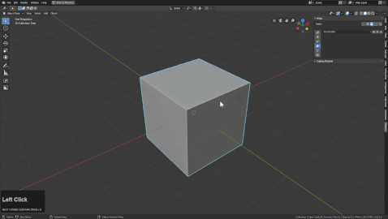
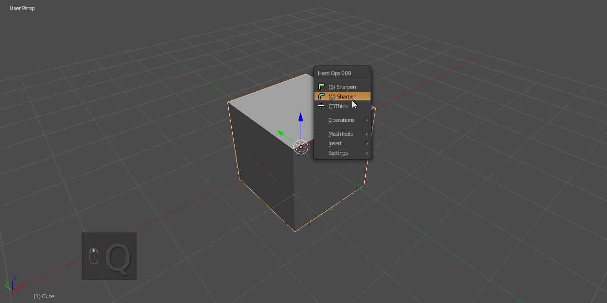
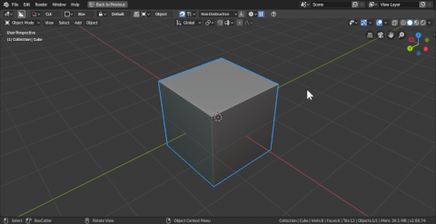
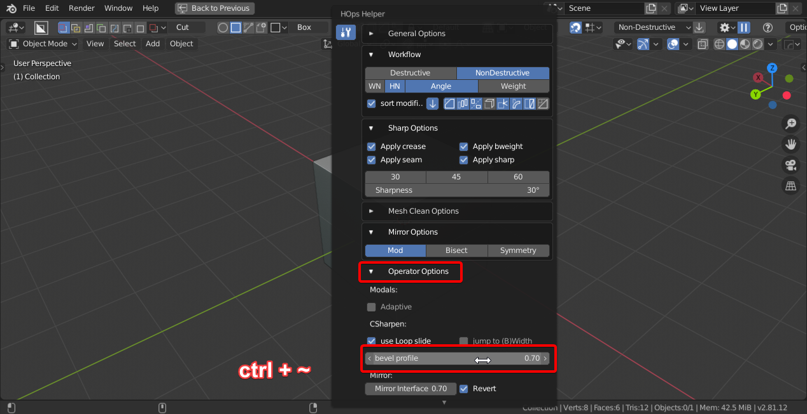
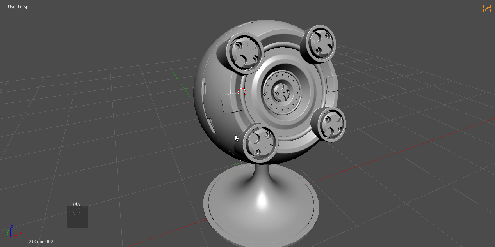
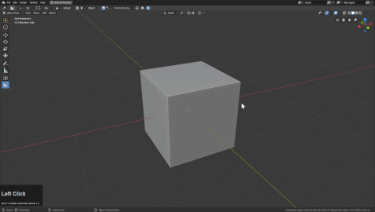
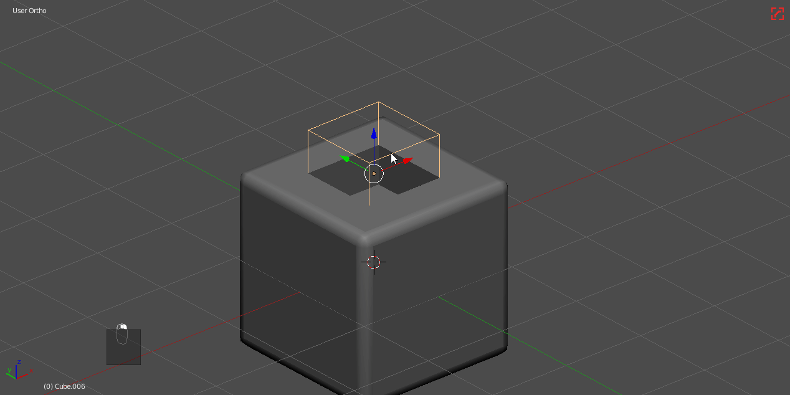
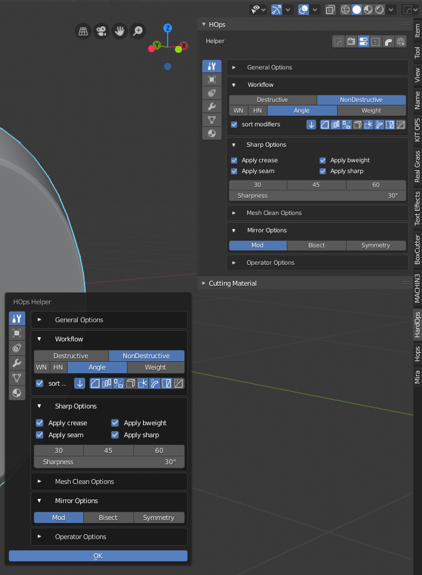
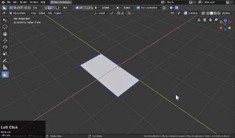

### bWidth

## What is bWidth?

bWidth is the name of the modal used for adjusting the bevel width of a modifier interactively in the 3d view.

There are additional uses

---

## bWidth use cases

If the mesh is undefined:

<kbd>Q</kbd> >> [Operations](operations.md) >> bWidth

- weight means this will only work on marked edges
- no clamp overlap means this will be capable of exceeding geometric limits
- adding bweight without csharpen will result in an angle bevel being added

As of 2.8 the goal is to try to be more non destructive so the default is now angle which ignores edge weights.

> [Csharp](csharpen.md) : In the event you desire classic behavior set workflow to weight in the <kbd>ctrl</kbd> + <kbd>~</kbd> helper.

If the mesh is [csharp](csharpen.md) / [cstep](step.md):

<kbd>Q</kbd> >> bWidth (after csharp)

- angle means this is not connected to the hops systems and is a default bevel mod
- clamp overlap means this mesh is limited by its geo to ranges unable to exceed understanding.

This is important because the behaviors will be different. While there is a time and place for bWidth on undefined meshes we typically use it on csharp meshes for refinement.

In addition, it can be used to adjust the bevel width of one or more objects.

When used on multiple objects it is capable of respecting differing offsets and even more.

---

## bWidth detailed usage

> When pressing <kbd>H</kbd> during a modal, the help will be displayed.

- scroll - raises and lowers segments. When it comes to segments the following applies:
  - 3 is default because the geometric count hit isn't too hard.
  - even numbers work best with material indexes
  - 6 will make it capable of not being rebevelled by ssharp/csharp at 30 degrees

- <kbd>ctrl</kbd> - changes profile. We generally stick with .7 by default
- <kbd>w</kbd> - changes offset type / never used
- <kbd>v</kbd> - shows / hides bevel modifiers. Can be useful as a toggle for multiple objects
- <kbd>z</kbd> - shows wire in viewport. has uses extending past just seeing bevels. Also can be used to quickly show wires.
- <kbd>1</kbd> - toggles autosmooth / for times where you need to toggle autosmooth within the bevel operation
- <kbd>2</kbd> - use bevel verts (makes bevel use only verts)
- <kbd>a</kbd> - Adaptive Mode (added by [machin3](https://twitter.com/machineio)) makes bevel segments adjust according to scale.
- <kbd>c</kbd> - Loop slide / See mod tooltip
- <kbd>s</kbd> - Modal segments
- <kbd>e</kbd> / <kbd>shift</kbd> + Wheel up - allows user to move mod up the stack
- <kbd>Q</kbd> / Shift + Wheel down move mod down stack
- <kbd>p</kbd> - Change profile
- <kbd>n</kbd> - Flip Normal - used for reverse bevelling.
- <kbd>m</kbd> - Harden Normals

Usage of the <kbd>n</kbd> - flip normal in action. **only in edit mode**

> In this example I used a boolean which set the shape as a boolshape which triggers face normal flipping for edit mode bevelling built in by default. Alternatively users would have to press <kbd>N</kbd> during modal.

---

## bWidth advanced

# Setting default profile

Sometimes the profile of .5 as the default instead of the .7 default of HOPS is preferred.

It can also be set in preferences.

And the ctrl + ~ helper

# Modifier Differences For Undefined / Csharp meshes

The option is intended to be generally used in the <kbd>Q</kbd> menu following the [csharp](csharpen.md) operation.

The bevel default modifier created is like this:

For Csharp the setting specified in workflow determine the bevel added.

If used on undefined meshes the modifier created looks like this:

# bWidth for disabling modifiers temporarily / viewing wires

**<kbd>v</kbd>** during modal will make the bevel modifier hidden.

**<kbd>z</kbd>** during modal will show wires on all selected models

# bWidth will not work on non objects

At the beginning of this gif the options are greyed out due to my all selection including curves. This is due to the context sensetive nature of the of the operator.

# bWidth to bevel cut

This options is in the boolshape menu for a reason. By beveling shapes before committing you can round out areas being cut for a machined surface.

Modifier order matters here as well so it's important to keep in mind what is on top and how that can affect behavior and cause undesired overlaps.

# reverse bevels

When selecting a boolshape's face in edit mode the normal will be flipped which makes the bevel go outwards resulting in an interior cut.

Alternatively pressing <kbd>n</kbd> during bwidth in edit mode in face selection with a face selected will make the normal flip.

<iframe width="560" height="315" src="https://www.youtube.com/embed/6TdRQc1Grws" frameborder="0" allowfullscreen></iframe>

# Bevel Sorting

Bevel sorting has also been added to hardOps. This allows bevels to be added after the boolean but not interrupting the previous ones.

Sorting options can be found in the <kbd>ctrl</kbd> + <kbd>~</kbd> helper in the workflow area or the hops helper or hopsbutton.

In this example I am able to stack multiple levels of bevels and cut the boolean only in the last level.

<iframe width="560" height="315" src="https://www.youtube.com/embed/ZnyMUIilp6g" frameborder="0" allowfullscreen></iframe>

# How does reverse bevel work?

In edit mode with a face selected on a "boolshape" the face will be flipped resulting in a nice outwards bevel.

Even if HN is on this feature should ignore that since harden normals would affect the shading. (we try to avoid cutting custom normals into other meshes).

> Notice how harden normals is ignored on boolshapes.

This video goes more in depth on the topic.

<iframe width="560" height="315" src="https://www.youtube.com/embed/6TdRQc1Grws" frameborder="0" allowfullscreen></iframe>

___

# Bwidth Auto-Smooth Toggle with 1 during modal

Pressing 1 during bwidth will change autosmooth from 60 to 30 which can be helpful for addressing shading issues. We plan to expand this in the future with a shading subsystem that takes over during all modals to ensure smooth shading all throughout the process.

# bwidth auto-smooth toggle for angle specific workflows

<iframe width="560" height="315" src="https://www.youtube.com/embed/szrnUx_2_uk" frameborder="0" allowfullscreen></iframe>

In 2.8 the parameter "Harden Normals" was added to the bevel modifier. While it's capable of being useful for shading later in the model this can have issues with the start of the cylinoid video.

> The <kbd>ctrl</kbd> + <kbd>~</kbd> helper can allow users the change workflow or using the N panel.

This is what happens if the HN (harden normals) parameter is on.

The shading looks incorrect for the following reasons:

- harden normals is on making the normals look smoothing
- autosmooth is set to 60 and not 30.

Here is how I would fix it using the <kbd>ctrl</kbd> + <kbd>~</kbd> helper.

And here I am working on both the shading and the Harden Normal not being on.

This should not be an issue in the most recent update. <kbd>1</kbd> during bwidth will now fix the shading properly. We apologize for this being an entry level gotcha. Markets have been updated with this change. (9-6-19)

---
