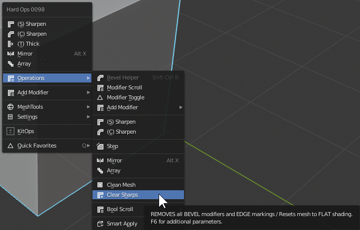
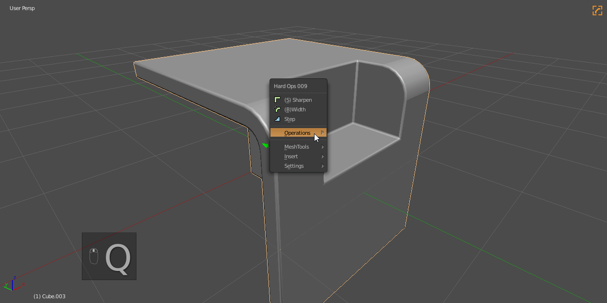
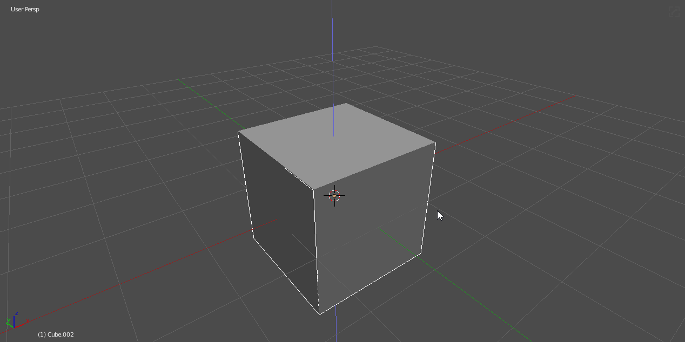

### Clear S/c Sharps

Clear sCsharps was created to clear the sharps from a mesh and and return it to an undefined state. When ran clear sCsharps does the following:

- clears bevel / crease / edge mark data
- sets shading to flat
- turns off autosmooth
- removes any bevel / solidify modifiers present on mesh
- sets [status](sstatus.md) to undefined basically making it a neutral mesh to the HOPS menus.

In the event you want to undo the hard ops process on a mesh for other reasons this option is located in

> Q >> Operations >> Clear sCsharps

## Clear S/c Sharps in Action 

The mesh in this example is both in a solified state but also [cSharpenened](csharpen.md). When the operator is ran the mesh is sent back into an unmodified state with the ssharpening removed.

The logo in the corner goes from:
- Orange - cSharp
- White - undefined
- Orange - cSharp
- white - undefined

This is one way we keep up with the sstatus of an object without words.

## Other Uses

The option to quickly reset the things on a mesh that can be troublesome when using it as a boolean shape is also present.

> In depth to explain this: if you bevel a shape with a bevel weighted object you run the risk of inheriting bevels that were unintended.

In the above example I received a double bevel on the area that were cut into the form. This is not good and can cause artifacts in the modelling and render.

Now let's clear the sharps before booling into the form.

This is a better practice and can also prevent boolean errors in the subsequent steps. It is recommended to not cut any ssharp information into another shape without being prepared for the results.
