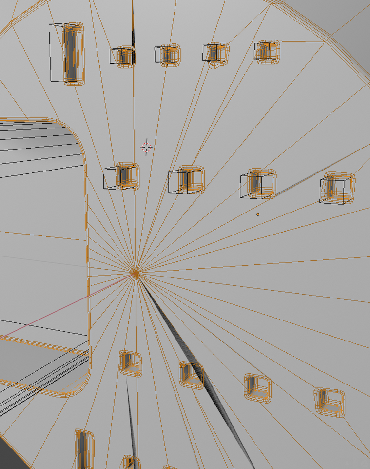
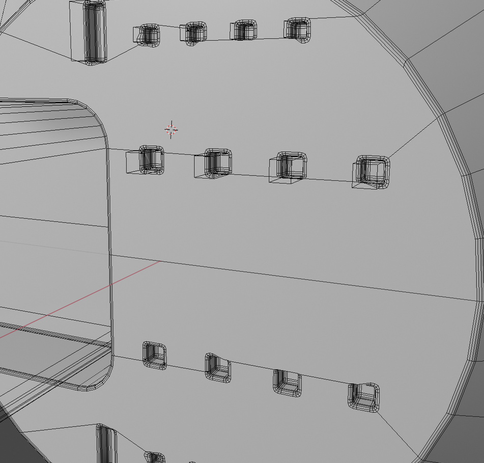
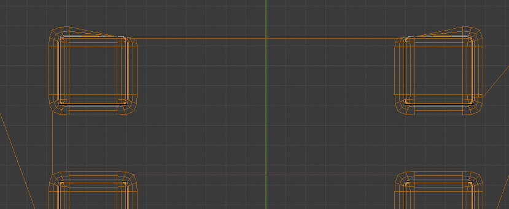
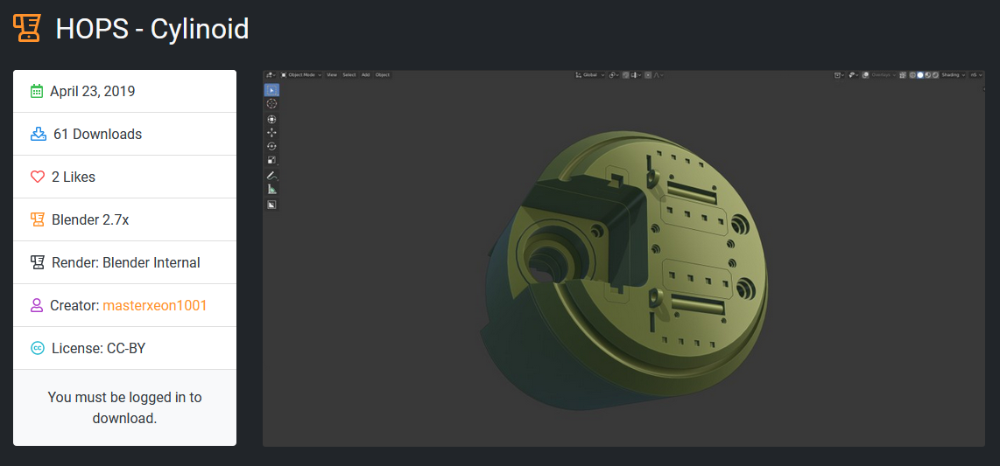

### Cylinoid Discussion

<iframe width="560" height="315" src="https://www.youtube.com/embed/szrnUx_2_uk" frameborder="0" allow="accelerometer; autoplay; encrypted-media; gyroscope; picture-in-picture" allowfullscreen></iframe>

> These are based on user examples and discussions / comments.

# How to fix the bevel after Decimate.

This can happen from not having the decimate present in the modifier stack.

This will be the resulting geometry when the boolean is made with a simplified surface. Blender will just figure out a solution for the geometry to make the connection.

In the scheme of things it's rather small and more cuts will just add to it but there is also a way to control the result. Usually I'll just keep going and deal with it later if it is still an issue.

# Fixing Boolean Flows w/ Bevel

Booleans can cut as you all know but the ability to imply geometry is equally powerful and is worth considering.

By cutting in an edge flow to supercede the square cut it would be much easier.

Notice that right here I do a cube cut that seemingly does nothing that skim off of the top. This will come in handy for controlling the final result.

In most cases the above will suffice but it can be better. Here I'll use object scroll to bring back the cube to help the array boxes bevel better.

One guidance loop is all that is needed in this case. And with that the bevel is clean.

With more work and loops things will work smoother.

Hopefully that should give more insight to how it could be approached and controlled. I am sure in mine I was a little sloppier.

My result is here. https://www.blendswap.com/blend/22843

