### FAQs / SFQs

# How do I apply a boolean I set up with Hard Ops?

Quickest answer. Apply the modifier. A boolean is just a modifier in your modifier stack. However this isn't the quickest or most recommended.

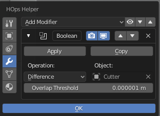

First lets set up a boolean and examine what is happening.

By pressing (ctrl + ~) I am able to see the modifiers on the object via the helper. This can be an easy way to quickly see whats happening with an object in the 3d view.

From the helper you can apply like and modifier or apply it using csharpen which is one of the primary purposes of the behavior.

Csharpen is being used in the above example to apply the modifier as you work forward thus making the workflow faster and easier than going through panels and menus.

# Why does my symmetrize work on the opposite side?

X - Symmetrize will work on either the left or right side of the model.

The selected option of X is rather unique because there is more than 1 version. The default is left handed. You can press F6 to change the behavior post operation as the below example.

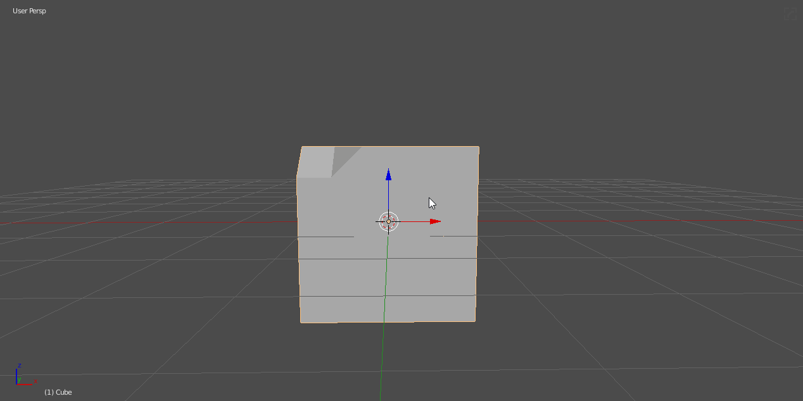

But to make it always on the right side by default.
  - ctrl + alt + u brings up user prefs
  - addons tab >> search for hard Ops
  - activate right handed

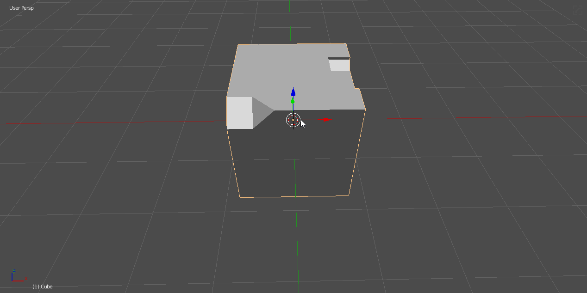

Now the symmetrize will behave on the side opposite of the default.

Automirror has no wrong side same with mirror mirror since they operate via modifiers.

# How Do I Install Hard Ops / Boxcutter?

 [See Install](installation.md)

# Why is the add-on checker not working?

The recommended addons will show checkboxes when the supported plugins are present.

This can have issues if the naming is different than what it is looking for.
BoxCutter for example requires the folder is named "BoxCutter"

If the naming is not exact this will cause issues. Just rename the .py to resolve the issue.        

The naming is as follows.       

- [BoxCutter](https://gumroad.com/l/BoxCutter/)     
- [Group Pro](https://gumroad.com/l/GroupPro/)      
- [DECALmachine](https://gumroad.com/l/DECALmachine/)       
- [Mira Tools](http://blenderartists.org/forum/showthread.php?366107-MiraTools)     
- [Batch Operations](http://wiki.blender.org/index.php/Extensions:2.6/Py/Scripts/3D_interaction/BatchOperations)        
- [Pipe Nightmare](https://blenderartists.org/forum/showthread.php?414316-Addon-Pipe-Nightmare-0-3-31)      
- [Easy Lattice](http://blenderaddonlist.blogspot.com/2013/10/addon-quick-easy-lattice-object.html)     
- [Auto Mirror](http://blenderaddonlist.blogspot.com/2014/07/addon-auto-mirror.html)        

This can be an issue to some however it is recommended to just check the folder naming. We are currently looking into improving it but it was intended to be a quick checklist to assist with troubleshooting.

To troubleshoot further you also can run the following command in the scripting area of the scripting tab.

**bpy.context.user_preferences.addons.keys()**

This will show a list of all the add ons present. This is how we troubleshoot this area when the plugin detection is not working.
___

# Why am I having issues when I boolean certain areas?

see [boolean tips](tips_boolean.md)

___

# How do I bake alpha maps / height maps from a Hard Ops model?

I assume you mean bake in substance painter or get normal / height maps.

Also I must add [DecalMachine has it's own system worth looking into for baking out decals to textures.](https://www.youtube.com/watch?v=YCUV8pS7MXQ)

If you wanted to be lazy you could make a version without bevelling and use x-unwrap on it to get some quick UVs.

Then export the bevelled as the high and the unbevelled triangulated as the low and with the correct settings you should be fine. However the best work is done by UVing and properly creating a low but workflows for hacking your way through exists.

And then exported.

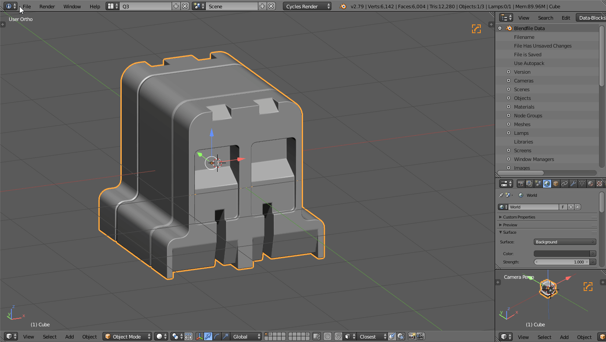

Xunwrap provided some UVs however you can also preview them using operations << UV preview.

Now in substance painter I bring up the mesh and do a quick bake.

The UVs provided will do for such a boxy example however when inserts and material colors are present you will need to accomodate for baking ID maps and so on.

___

# What is Cstep / step?

In short.

**Cstep** - cstep is an [sstatus](sstatus.md) for baking bevels while keeping a bevel modifier active for new intersectional bevelling.

**step** - bakes bevels while adding a bevel modifier back to the mesh for new bevelling.

[See Step](step.md)

___

# Why is my mesh hidden when I step?

Step hides the mesh when used. See [How does step work technically](step.md)

  - press alt + h to unhide mesh
  - press h to hide mesh

# Can I get out of Cstep?

Absolutely. Q >> meshtools >> sstatus reset

> **q >> meshtools >> status reset** will reset any mesh back to a default state. Causing the Q menu dynamic options to also be default instead of cstep oriented.

___

# Why is it called Step / Cstep / Ssharpen / Cssharpen?

The naming made sense at the time but the functions are best described like so. Someday the tools will be unified into something more logical however in the meantime we needed some sort of terminology for naming.

When I was originally writing a book about modelling I found myself saying repeatedly:
tab >> editmode >> select sharps >> mark sharp >> mark seam >> mark crease >> mark bevel weight

Over time I just simplified it into that for my own sake however after they became tools the names just stuck.
Since it's version 9, changing names might confuse actual users just to appease people who possibly are not even using the tool nor plan to.

___

# Why doesn't (ctrl + j) join an insert to the mesh?

Well ctrl + j in object mode is reserved for joining meshes in the blender API. Unfortunately if you select and insert / AP / BB and mesh and press ctrl + j you are only joining the meshes together which is not the intended behavior.

To properly join an red insert use the q menu system.

[Read About Inserts](inserts.md)

___

# Can I add my own inserts to Hard Ops?

No. However it is possible but not recommended since it's not user friendly.
For custom inserts I recommend the [Asset Management](https://gumroad.com/l/kANV/). This is a temporary solution but we do have plans to expand this down the road.

___

# What do the different inserts mean?

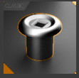 Orange Inserts are just basic inserts. These can be inserted in edit mode orented to faces.

> Orange inserts can be inserted on a series of faces and can be scaled immediately after selection via a modal operation. This allows for scaling to perfection. It even sets the pivot points to individual origins so they retain their position.

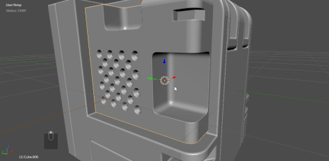

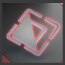 Red Inserts are inserts made to be boolean cut into surfaces.

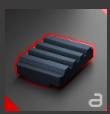 Adjustable inserts are inserts that can be adjusted for additional length prior to being applied.

>Red inserts also do not get inserted on faces. They always are inserted at the 0,0,0 of the 3d view. This is because they dont behave well being placed automatically due to the hook modifiers that the adjustable ones have. These inserts also have an AP that allows for surface snapping while also seeing the outside perimeter. This allows for precise placement.

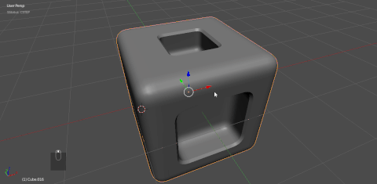

> Red inserts are built up out of these 3 pieces.
  - AP or alignment plane (used for aligning the whole insert)
  - BB of BoolBox (used for the boolean to make room for the OB)
  - OB or Object (the object being inserted)

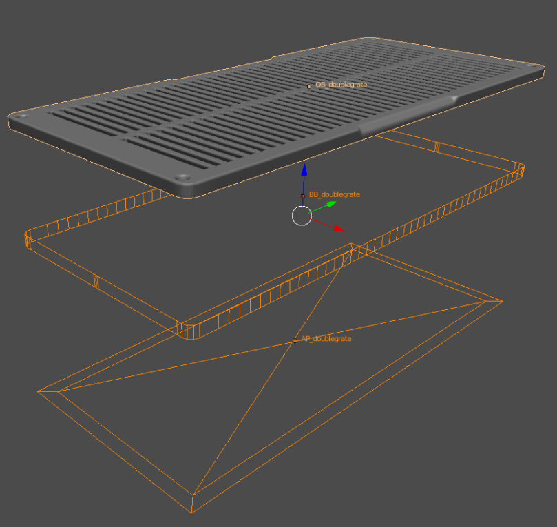

[Update Log Explaining Red Inserts ](https://masterxeon1001.com/2016/01/05/hops0065update/)

___

# Help! Why doesn't this add-on show activated in the add-on checker!

By using this line in the scripting area of blender you can see all the add-ons  activated.

bpy.context.user_preferences.addons.keys()

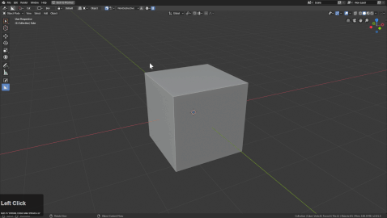

The Boxcutter add-on folder requires the naming be "BoxCutter"

You can also find the foldername in the addon file area.

This is how it would be fixed in the add-ons directory.
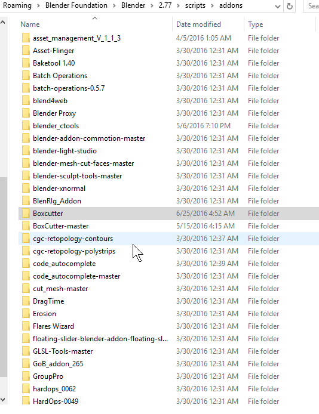

Now I can start boxcutter with Alt + W

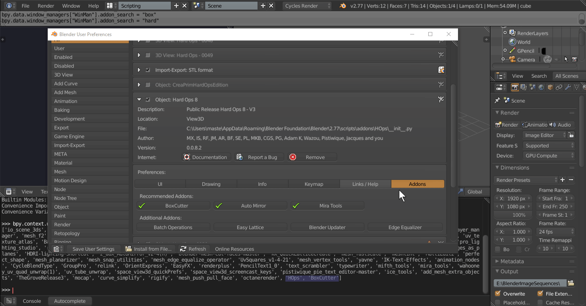

Mira tools also is the same way.

In my add ons folder it is just called mira_tools. For this addon it can get complicated since the naming is rather specific.

I must add that the add on checker doesn't really matter. It was attempted to be a convenience thing. However some issues that users find with it is due to the naming.

___
## Mira Tools

# Why doesn't curveStretch or curveGuide show up in the Q menu?

Check the add on preferences for Hard Ops under the add on tab. If Mira tools is not enabled you must download and install it.

[Mira Tools](https://github.com/mifth/mifthtools/archive/master.zip) /
[Thread](https://blenderartists.org/forum/showthread.php?366107-MiraTools)

If mira tools is not enabled the icon next to the button will show an error.

The below example shows how installing it and enabling it allows HOPS to use it as well.

