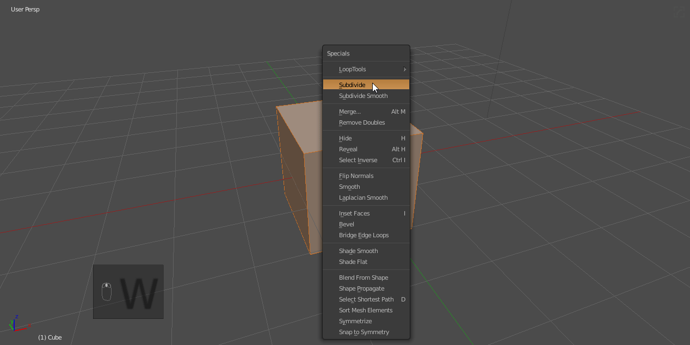
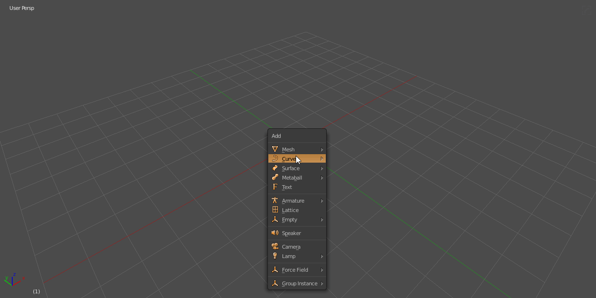

### Getting Started With Hard Ops

Hard Ops can be brought up one of 3 ways.

## Q  - Menu

Pressing Q will bring up the Hard Ops Q menu.

> The first 3 options will always be dependant on context and is what we call the big 3.

We'll be going over the options later in depth. See [options](options)

## Shift Q - Pie Menu

Pressing shift + Q will bring up the Hard Ops pie menu.

The pie menu is the same as the q menu. Icons are not in the pie menu due to speed issues but is the same format of options as the Q menu. The options change based off of context.

## T - T Panel

In the vein of most plugins Hard Ops also has a t-panel for options that can be useful for beginners or those who like seeing all the options all the time.

Even in the examples I have a hard time using the T panel. Pressing Q is just so fast.

---

## Q Menu Option Types

The Q menu options are not just for meshes.

**Camera Q - options**

- options for lens / depth / dof / target and even set active cam

**Lattice Q - options**

- simplify will change all the x/y/z parameters of the lattice to 2 simplifying it for large form changes.

**Curve Q - options**

- 1 curve will allow you to do a 3d taper and set the spans around and along the curve.
- 2 curves will allow you to do a curve taper and set the 2nd curve to the 1st curve as a taper object.
