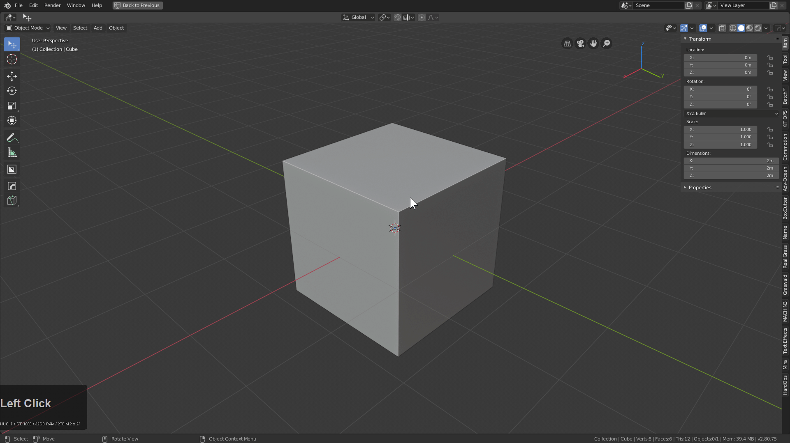
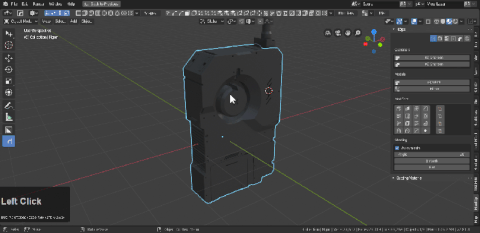
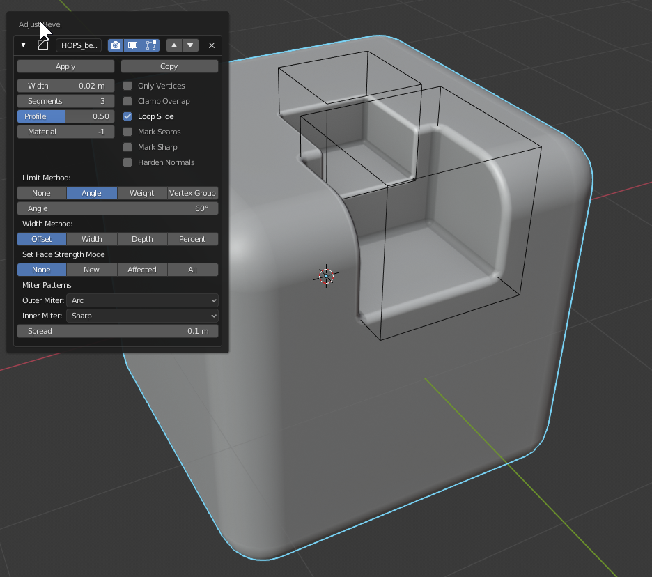
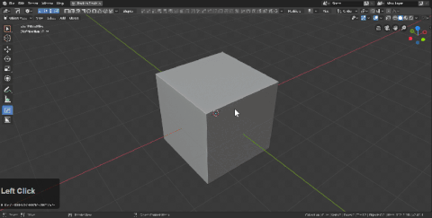
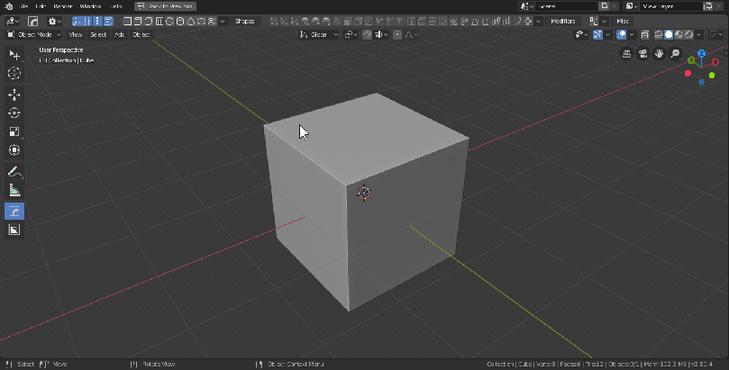
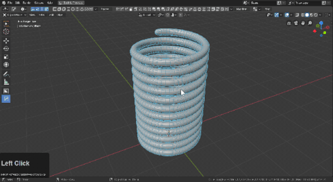
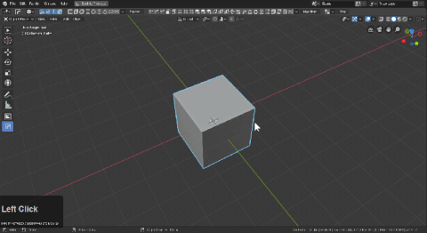

# hopsTool

HardOps version 983 introduces the first active tool of Hard Ops called hopsTool. We intend for this tool to provide a simple ui to assist with modifier management for non destructive modelling in the 3d view.

When hopsTool is active pressing ctrl will show up dots that can be adjusted for quick manipulation on the fly. Clicking the dot brings up the modifier for fine edit.

If boxcutter is not installed the hotkey is alt + shift + W.

If boxcutter is installed then hopsTool is swapable with alt + W.

hopsTool also adds a nifty little n panel toolbar.

# Breaking down the UI

hopsTool is primarily able to be used via the topbar.

[hopsTool will need the topbar to show.](https://twitter.com/mxeon1001/status/1123820309168177154)

- Display - options dictating what shows when ctrl is held.
- hShapes - procedural shapes for users to insert and get started with
- Modifiers - add modifiers on the fly w/ adjustable dots for certain ones
- Misc - mirror is the only option here for now.

You are also able to simplify the topbar.

---

# Boolean dots

While hopsTool is active users can select 2 objects and hold ctrl to bring up boolean dots.

- cut
- join
- slice

are available at this time.

Boolshapes also get their own dot which is where the view can get cluttered quickly.

Fade distance can be adjusted if needed and booldots can be turned off if they are getting in the way.

---

## Non-Destructive stepping

Using the [hopsTool](hopsTool.md) you can stack up bevels easily in the viewport.

There are 3 bevel icons in the topbar. All with special purposes.

-  corner bevel (intended for planes and vertice beveling
-  chamfer (bevel w/ 1 segment)
-  rounded bevel (3 segments default angle 30 / ctrl + click angle 60)

To showcase each in action.

In this mode holding ctrl shows modifier dots. LMB clicking one shows the modifier information.

Levels can be added very quickly this way.

Also working this way is possible using the Q menu add modifier system.
A few things to note:

- first bevel can be an angle 30 or 60
- second bevel cannot be an angle 30 or else it will catch the first bevel
- bevels from here on are 60 and above to keep simplicity.

The gif shows me adjusting bevels that aren't showing to set up levels I did moments later. Also the shading was incorrect due to not holding shift as well as ctrl to set it to 60 and not 30. But this is a good example of how the angles can work against you if you aren't mindful.

---

# Building from a vert

Collapsing a cube to a vert and using handles to guide spins and then add mirroring, decimation, solidification, and 3 levels of bevels can be a fun way to wrap your head around the process.

# Try making a tire from a plane.

By adding a displace, screw and solidify a rim can be made in short time and be dynamically adjustable.

# Things to know

## The topbar can be simplified

## Ctrl + shift clicking dots allow for alternative modification.

Bevel dot adjusts the width but ctrl + shift allows for segment adjust.
The info text up top lets users know whats being adjusted.

On screw ctrl + shift left click dragging adjusts the steps in screw

Simple deform also gets dots for making large adjustments on the fly.

When using hops tool w/ boxcutter and racking bevels the ctrl + add mod behavior adds a mod at 60 degrees which is smoother for going to box city.

## The n panel can display your modifier stack so get in there and look at the mods.

## If you get confused about how a shape is constructed just mod scroll it.

