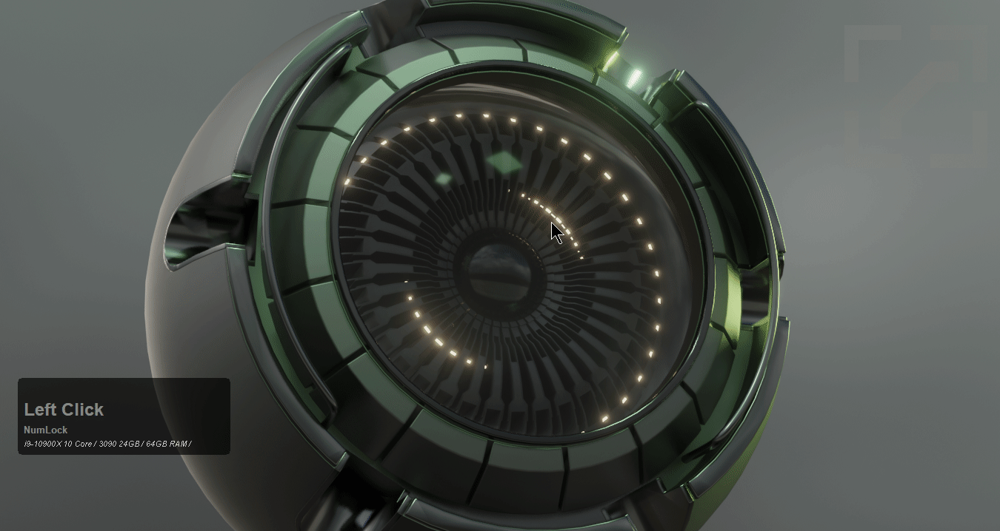
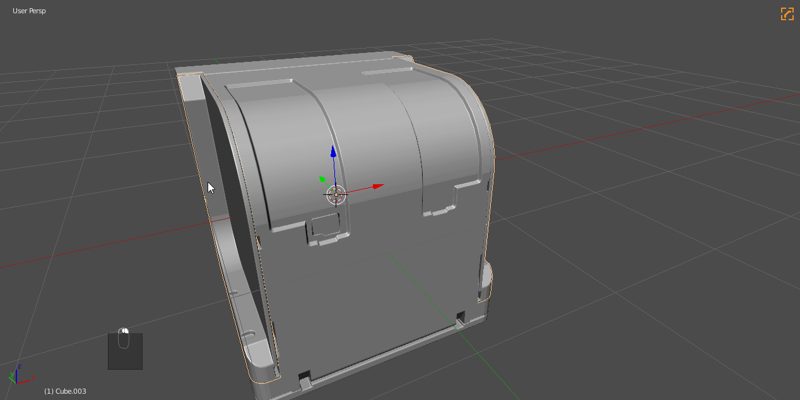
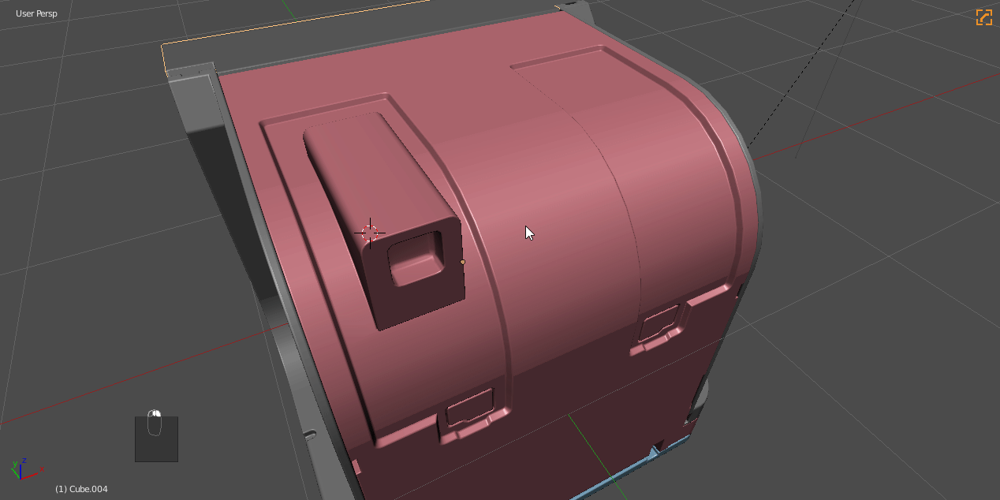

### Essential Hotkeys

## HOPS Hotkeys

# Q / Shift + Q - Menu / Pie Menu

These are the core of Hard Ops and are the intended  method for choosing and finding functions for Hard Surface Operations.

# Ctrl + ~ - HOPS Helper

The HOPS helper also known as the modifier / material / misc helper is a series of helpers for using Blender quickly in fullscreen.

The Helper is used for working with the following.
- modifiers - adding / reordering / deleting
- materials - shader assignment and adjustment
- misc - sharpening behavior / hard surface options / boolean behavior / misc options

The Hops helper is one of my favorites in Hard Ops and has it's own page.

See [HOPS Helper](helper.md)

# Alt + M - Material Helper

The material menu was a happy accident that showed much potential in the click and go workflow of Hard Ops.
This will assign a material to the selection with a list of shaders in the scene.

**NO MATERIALS COME WITH HARD OPS ASIDE FROM INSERT PLACEHOLDERS**

I have a material sphere on layer 10 of my default scene that holds the materials I have in my scene. I usually delete it from my final file. [For more in materials I wrote a blog post about that.](https://masterxeon1001.com/2016/03/31/setting-up-blender-for-success/)

# Alt + V - Viewport Menu

When using Blender sometimes helpers/empties and lights clutter up the view when modelling and form is the only focus.

Alt + V has options for simplifying the viewport and is useful for quickly changing your views.

# Ctrl + Numpad (-/+//) - Boolean Operators

Booltool started a revolution when it showed a quick way to get quick booleans non destructively and without many clicks or hotkeys. Over time the tool evolved far beyond its initial use and is no longer being developed by the same person. So in the end we built a simpler version in HOPS that has the drawing and is more aligned to the workflows utilized in HOPS.

>  Booltool is no longer needed for HOPS. If enabled we will respect its hotkeys and allow its usage alongside Hard Ops but that is not recommended.

The HOPS Boolean hotkeys are as follows.
- CTRL + NUMPAD Minus - Cut
- CTRL + NUMPAD Plus - Add
- CTRL + NUMPAD Slash - Splits

---

## Manual Hotkeys

There are many hotkeys that I set manually in Blender.

# Select Boundary - (shift + ~)

Select boundary will convert a selection to the edge perimeter. This can be useful if you need to bevel a boundary and add an inset. This is something I do quite a bit in my work and is essential.

Select Boundary is in the Select Menu at the very top. To set the hotkey I right click and choose to change shortcut.

# Mark Sharp - (ctrl + ~)

Marking sharps is essential in a Hard Ops workflow for fixing shading issues without bevelling or using mark ssharp in the edit mode Q menu. This is something that is only for edit mode. Ctrl + ~ in Object Mode brings up the Hard Ops Helper.

# X Symmetrize - (Alt + X)

This is not related to MirrorMirror or Automirror.

X/y/z symmetrize are (symmetrize and be done) operators made by myself to enhance the behavior of Blender's own symmetrize in the w >> symmetrize menu. This is another hotkey that must be set manually via right clicking. This works for both edit mode and object mode.

