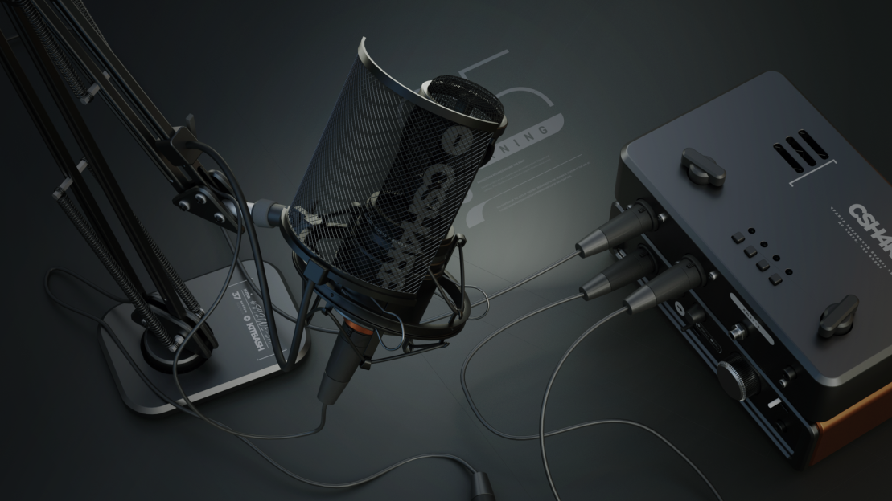

## [Hard Ops](https://gumroad.com/l/hardops/) Introduction Guide      

     

> This guide is intended to explain the basics and ideas behind [Hard Ops](https://gumroad.com/l/hardops/) and give       
> some insight to its usage and understanding.

[Hard Ops](https://gumroad.com/l/hardops/) intiailly began as a collaboration between myself and AR however over      
time, it has expanded to encompass a team from all over the world.      

*The goals initially were to make a tool that would make our personal lives easier      
when it came to modelling. But this expanded to be an entire workflow.*     

Now the goal of [Hard Ops](https://gumroad.com/l/hardops/) can be simplified into one line.       

**Hard Surface modelling and workflow assistance. A helping hand.**       

>There is no magic button. It won't make a better artist. All our tool can do is        
enable you to be the maximum you. The idea is the quicker you can work / make mistakes / corrections deviations and of course evolution.

---

At the beginning, [Hard Ops](https://gumroad.com/l/hardops/) was a tool for automating my own workflow. When I first began modelling I adhered to strict modelling guidlines and all quad rules without understanding the why. Robots and hard surface were my primary focus of assets yet topology remained the true decider of my modelling choices and set my design limitations. This ended up causing my models to be [simpler](https://youtu.be/hoaPM1C1vAE) without me truly understanding why.

After the creation of the [Booltool](https://blenderartists.org/forum/showthread.php?336498-BoolTool-0-2&p=2659836&viewfull=1#post2659836) and it's introductions into my workflow design became more free flowing. This allowed me to become more intimate with form and design since the workflow required particular edgework for [concept modelling](https://www.youtube.com/watch?v=0654GCPxDhw).

So with all that said. [Hard Ops](https://gumroad.com/l/hardops/) is capable of being used in all quad workflows however if [booleans](boolean.md) are introduced the topology becomes something you must [regain control](tips_boolean) of when you choose to take shortcuts. Many operators perform basic tasks while the primary tools have been rewritten over and over to obtain very specific behaviors intended to assist in the workflow of [robot creation](https://www.artstation.com/artwork/4lbn4).

In my personal opinion, [Hard Ops](https://gumroad.com/l/hardops/) is the end result of years of modelling by hand and clicking and tapping repetitive [hotkeys](hotkeys.md). It is my hope to make a tool that reduces keystrokes and turns processes into steps. As blender evolves so does I aspire this tool to as well. It goes without saying I would not have been able to get it to anywhere this point without a team of people all around the world. Smart minds in the community have contributed great and small to make this tool I once imagined the reality I now bring up when I press [Q](hotkeys.md).

---

For the guide the following extension to chrome is recommended for fast gifs.
[Gif Scrubber](https://chrome.google.com/webstore/detail/gif-scrubber/gbdacbnhlfdlllckelpdkgeklfjfgcmp?hl=en)
I tried to do them efficiently for space but also informative. I apologize in advance if they seem too fast.

<iframe width="560" height="315" src="https://www.youtube.com/embed/DKx8Pi4v6wc" frameborder="0" allow="autoplay; encrypted-media" allowfullscreen></iframe>

<iframe width="560" height="315" src="https://www.youtube.com/embed/PtDzjVGziK8" frameborder="0" allowfullscreen></iframe>

<iframe width="560" height="315" src="https://www.youtube.com/embed/igSGBYSTSL8" frameborder="0" allowfullscreen></iframe>

HardOps also has an older [wiki](https://masterxeon1001.com/2016/05/28/hard-ops-8-release-notes/).        

I hope that this guide answers more questions than it asks and makes the        
experience of using HardOps as easy as possible. I also hope it can give some       
insight into our hard surface process as well as indicate ideas for future      
plans and developments.     

> [Modelled by AR using hopsTool](https://twitter.com/AdrianRutk0wski/)

I would have never been able to make it to where it if not for the team. They are       
the driving force behind the development and without a team the work would not have     
been possible. The collaborative nature of the team and the willingness to invest       
time has been astounding and has helped this project live far longer than even I        
initially expected.     

goto [Video Playlist](https://www.youtube.com/playlist?list=PL0RqAjByAphEUuI2JDxIjjCQtfTRQlRh0)

80% credit goes to AR. He even helps me fix this damn guide...
