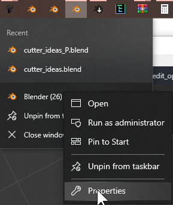
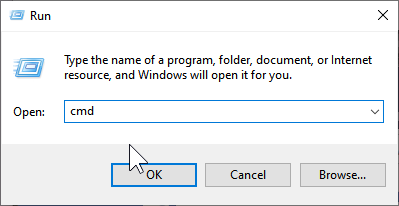

### Helping us help you

Being in a position of support has taught me how important it is to get adequate information on an issue.
Screenshots, gifs and videos of issues are the best way to help us resolve your issue.

Text descriptions can only go so far and we are often asking users for more information so the issues experienced can be triangulated and resolved.

# Capturing Issues w/ ShareX windows

When it comes to Blender crashes occur however being able to replicate it and provide steps for what causes it goes much farther for assistance with diagnosis.

For windows a small freeware app called [ShareX](https://getsharex.com/) is essential.

In ShareX I set my workflow to the above image.

Thanks to this I am able to quickly record gifs and screencasts of issues.

# Mac Help

The stuff it says in crash reports is not of use to us. I don't think non apple engineers can read that.

Getting the terminal output to remain after a crash is more essential.

# PC Help

When Blender crashes the console goes with it. By running Blender via the cmd you can get additional information that can help us fix issues.

Right clicking Blender while open to access the properties will get you the shortcut.

Windows + R >> Run Window >> cmd

> Brings up command prompt.

In the cmd paste the shortcut from the properties window.

Running blender this way will make the cmd be a terminal output. Providing us information on why crashes occur.

