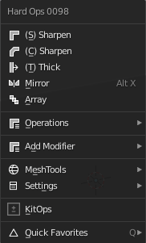
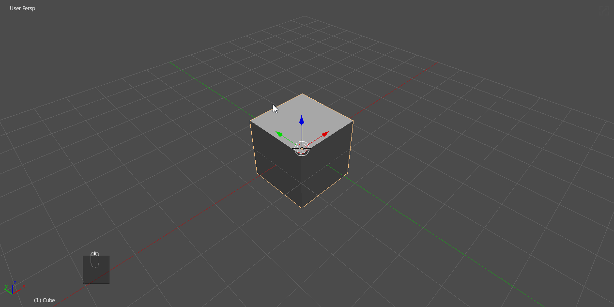
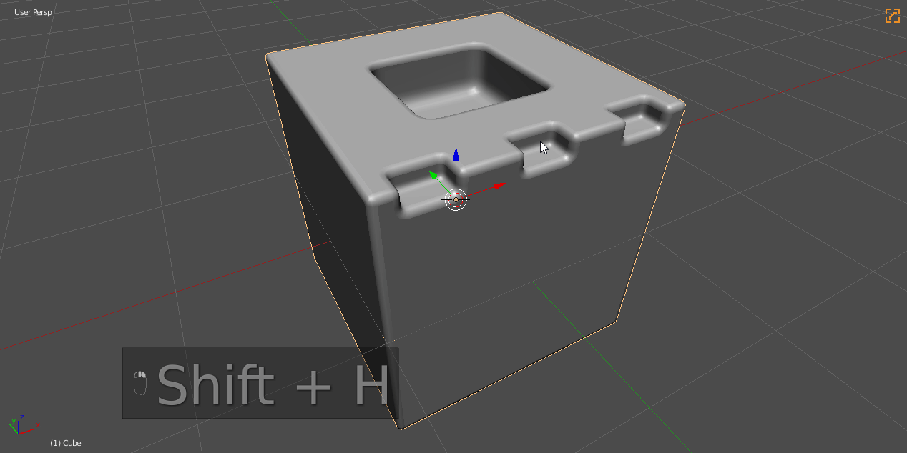
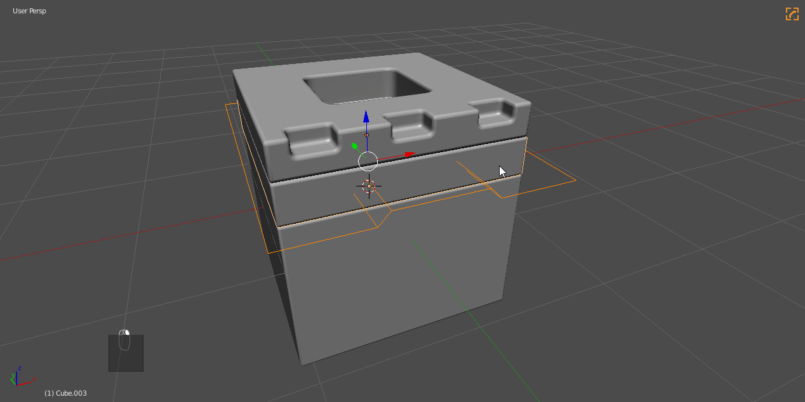

### Hard Ops Dynamic Menu System

Hard Ops's menu can be best explained through the Q menu that shows in an [undefined mesh](sstatus.md).

Besides the name its best broken down as follows:
- Recommended Options
- [Operations](operations.md) Menu
- Add Modifier
- Aux Options ([meshtools](meshtools.md) and [settings](settings.md) submenus)
- [KitOps](inserts.md)
- Blender Quick Favorite menu that is traditionally on the Q button.

The first 3 options are based off of the workflow in HOPS and changes dynamically. By keeping it at 3 the menu remains consistent despite context. This is at least visually appealing and has also created a level of control we didn't initially plan for.

In this example you can see the menu changing based off of context in this short example.

When I start out the top 3 are by default on [undefined](sstatus.md) type meshes the following:
  - cSharpen (for quick bevelling and jumping into a csharp workflow)
  - sSharpen (smoothing and sharpening the mesh without commitment to a system)
  - tThick (thickness via solidify)

Whenever 2 objects are selected a new option is added below for booleans. This is based off of the booltool workflow. There is also an option in the big 3 to slice using the [Slash](cslash.md) function

After a bevel modifier is added one of the big 3 is bwidth as well as the option to bake the bevels called [step](step.md). Because of the csharp state it would seem logical to have an option to quickly adjust the bevel amount on a mesh.

This workflow can become quite quick with practice.

The same applies to pie menus and T panels which also utilize dynamic options.

> Any of the options that show up in the big 3 are also located in operations for any case the users wants to jump around in the process. As of v9 all sharpeners were merged which simplifed the workflow for stepping greatly and thus all operators are usable aside from context specific ones.

---

## Other Menu Types

# Q menu for Camera

If you select a camera and press Q options will be available.

- Lens (setting focal length. I like 60 personally)
- PP (for making the outside dark for viewing what the camera sees)
- DOF Target (for some reason the eyedropper doesn't work yet)
- DOF Size (usually I start at 0.2 then divide in half until it is what I want)
- Set active cam (useful for animation camera swapping)
- [Settings](settings.md) (always present)
- [RenderSets](rendersets.md) (always present)
- [Viewport](viewport.md) (always present)

# Q menu for lattices

Lattices have Q options for spans on the X / Y / Z.

Even better there is an option to simplify which will take the spans of the lattice to 2 which makes it back into a cube basically.

- [RenderSets](rendersets.md) (always present)
- [Viewport](viewport.md) (always present)

# Q menu for Curves
