### Meshtools Submenu (Object Mode)

## What are Meshtools?

Meshtools are tools that perform quick operations that I use quite often in my workflow. There are also options for materials and a shortcut to the [HOPS Helper](helper.md). These options are just random tools and experiments that are useful in the hard ops workflow at certain points.

<iframe width="560" height="315" src="https://www.youtube.com/embed/iSQjRdiomlw" frameborder="0" allowfullscreen></iframe>

---

## Plugin

Extendable submenu for 3rd party tools that HOPS connects with.

Currently extends to the following
- meshmachine
- bezier mesh shaper
- mira tools

---

## HOPS Reset

Sometimes in the Hard Ops workflow you can go off the rails and apply modifiers or decide to escape the auto hiding behavior of [cstep](step.md) sstates.

While this sounds odd its worth thinking that from an undefined mesh you can :

  - go into csharp sstate with just a simple [csharpen](csharpen.md)
  - go from csharp to cstep with just a simple [step](step.md)

Sometimes backing out of the workflow and going back in without modifying the object can open the door for some interesting workflows. Not to mention resetting boolshapes to also deviate in their workflows as well and do shaping before committing booleans.

In this example you can see the boolshape at the beginning because of the red icon in the corner. After resetting the sstate I was able to treat the undefined but still live mesh as a neutral mesh using options from the [operations](operations.md).

> This option is all that remains from sstatus override introduced in HOPS 007.

---

## Twist 360

This adds an array modifier and a simple deform modifier. This also sets up the parameters according to my defaults. This is quite basic and is a less interactive version of Radial 360 however this doesn't diminish it's use, in fact it makes it more valuable.

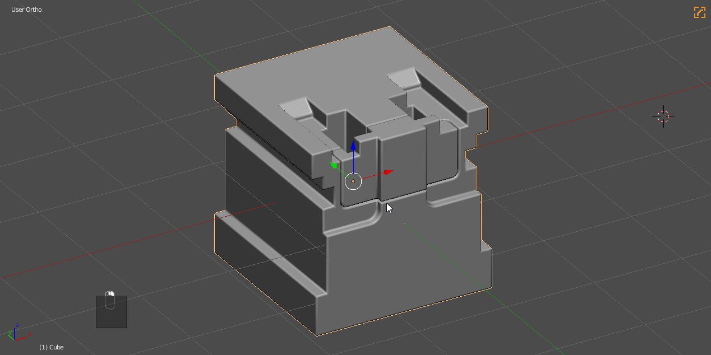

In this example I put the twist360 on the mesh and showcased the F6 menu. In order to make this primarily ngon mesh deform properly I had to use the knife and make some cuts before symmetrizing which got a more acceptable surface rendering.

# Twist 360 / F6 Options

array count - amount of arrayed elements

destructive / non - will re-center and apply modifiers by re-calucating origin

---

## Reset Axis

---

## Material List (Alt + M)

see [materials](tips_material_menu.md).

Pressing alt + M will list all the materials in your scene. If you have no materials this list will be blank.

***HARD OPS provides no materials besides the placeholders for inserts that are simple shaders and not recommended for rendering***

The material list has proven to be quite useful to assigning materials to assets. Just selecting things and pressing alt + m.

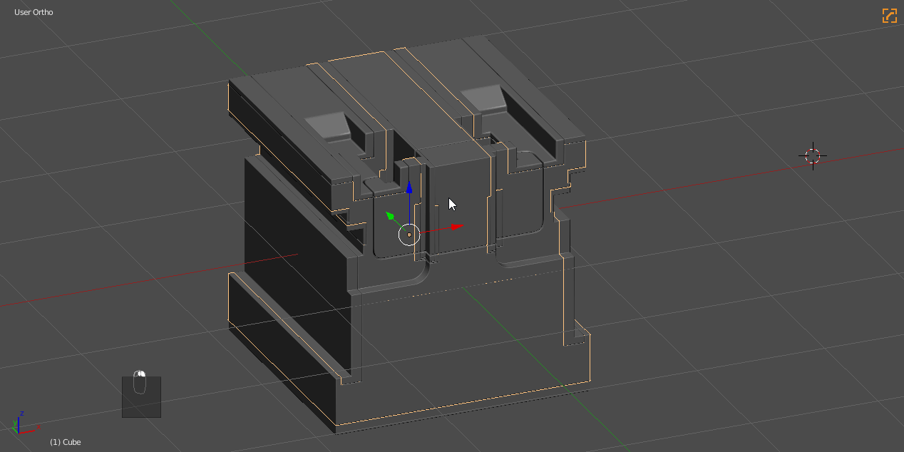

---

## Radial 360

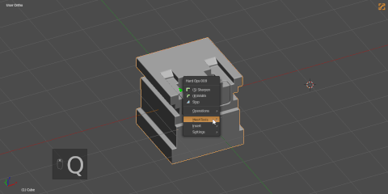

This tool is almost as old as Twist 360 except it has the drawingV1 still. This tool will array out according the the x position of the cursor but when R is pressed, will simple deform the shape into a circle. This is a classic tool that still has room to grow.

---

## [Modifier Helper](helper.md) (CTRL + ~)

see [Modifier Helper](helper.md)

Pressing CTRL + ~ will open the HOPS helper. This tool is now capable of much much more than dealing with modifiers.

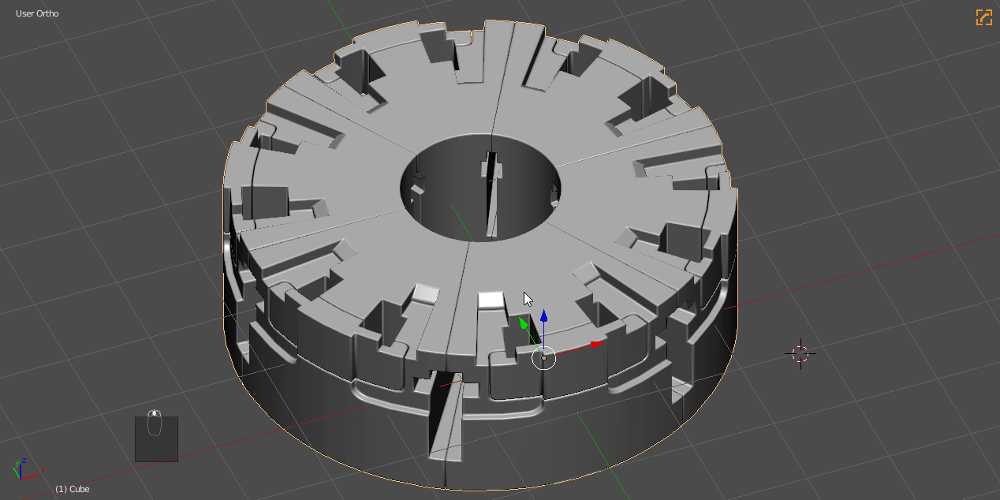

The HOPS helper is worth a look to see if the tool can fit in your workflow. The helper is indespensible for full screen working and has supercharged my personal workflow.

---

## Reset Axis (xyz)

**Reset axis is simple. It sets the location of an object's x, y or z axis to 0.**

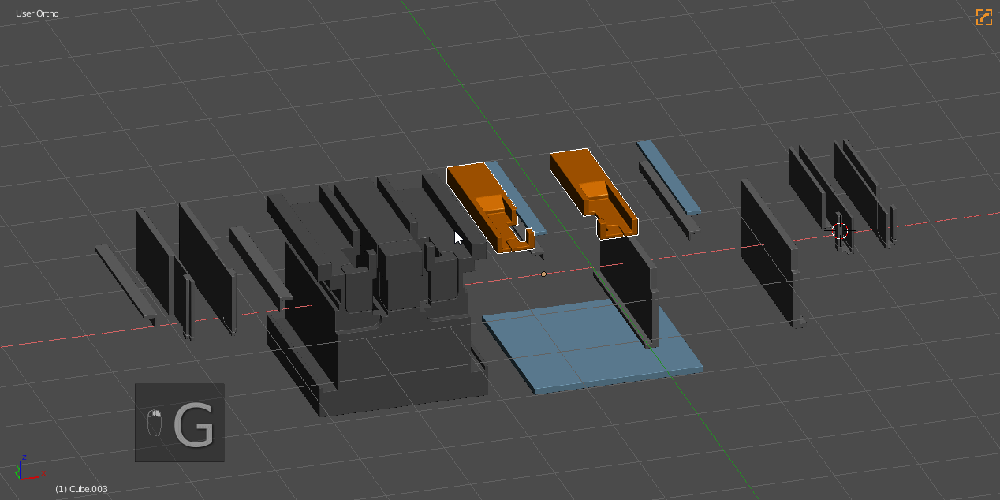

It's also a flatterner of sorts in edit mode. I don't use this very much however but sometimes it comes in handy.

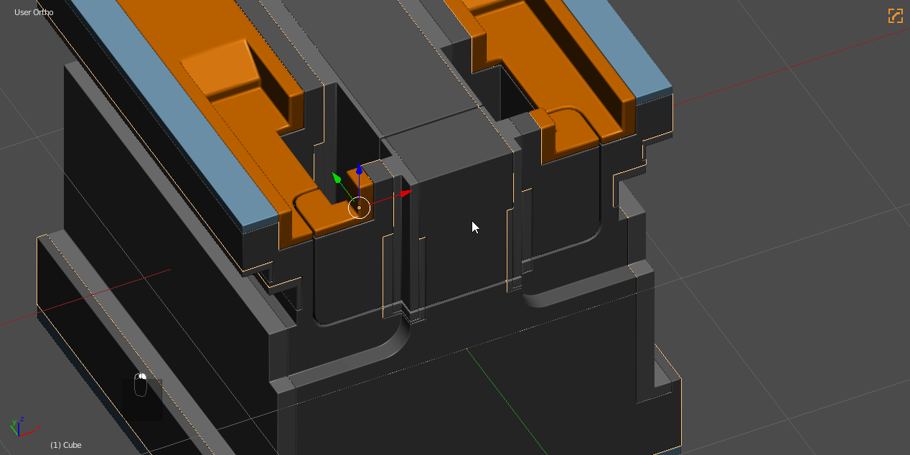

---

## Symmetry Options

see [mirror](mirror_symmetry.md)

This workflow can get complicated due to there being 3 systems we support but in short:

  - symmetrize is make symmetrical and be done. No modifiers are used.
  - auto mirror is self symmetry and involved bisection and uses the mirror modifier.
  - mirror mirror is primarily used to mirror objects across other objects.

For more information see [mirror](mirror_symmetry.md).

If you are still reading this, here is a demo of all 3 in action.

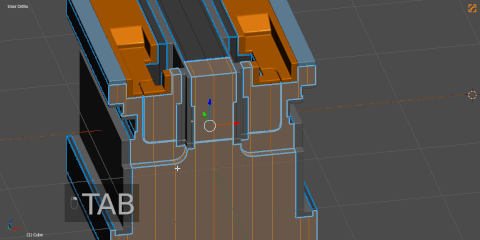

---

## X-Unwrap

When it comes to UVs I personally use the following tools to perfect UVs.

[UV Shotpacker](https://gum.co/UVShotPacker) | [Smart UV](https://gum.co/Smart_uv) | [UV Squares](https://blendermarket.com/products/uv-squares/)

That aside. X-Unwrap was a quick UV unwrapper we came up with for Hard Ops assets. It is capable of displaying the UVs in the 3d view saving the need to have a UV editor. I personally love this tool and can see some potential in advancing its workflow and features.

**It is just a quick and dirty UV unwrapper for quickly going to substance / unity / unreal / quixel.**

- If one object is selected, it will UV it to an entire sheet.
- If multiple objects are selected they will be atlas'ed on one UV setup.

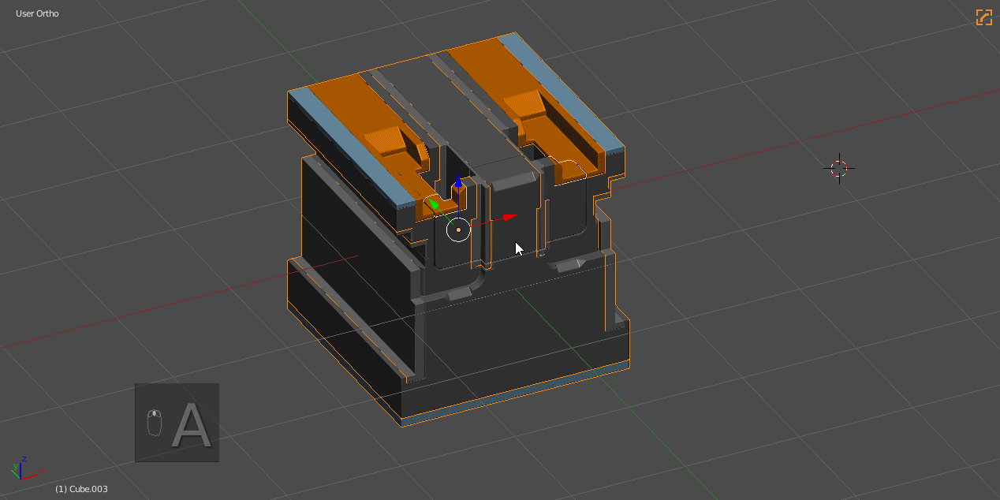

---

## SClean Recenter / ApplyAll (-L)

These tools are quite old however they still have a use occasionally.

Sclean recenter is for applying the modifiers involved in a twist360 operation and recentering the origin.

> When performing Twist360, applying it isn't always ideal at that moment. This is for the time when a user would want to apply modifiers / remove doubles / recalculate origin.

In the first example I'll use Twist360 nondestructively to model interactively,

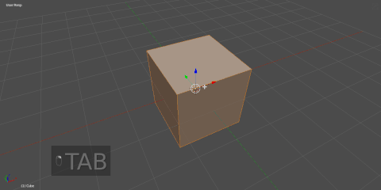

To apply it and make things real for progression I will now use Sclean and go into the [csharp](csharpen.md) workflow.

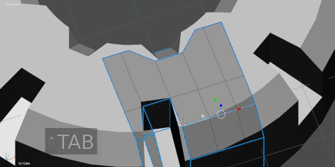

---

ApplyAll (-L) just applies scale and rotation but not location. This is also specialized and unusal in most workflows but once was more useful back in 003.

---

## [Boxcutter](https://gumroad.com/l/BoxCutter) (shortcut or link)

***Boxcutter is a separate tool*** that extends on the Hard Ops workflow in the boolean aspect. This tool is an intended replacement for the click heavy boolean operations that are inherent to hard ops.

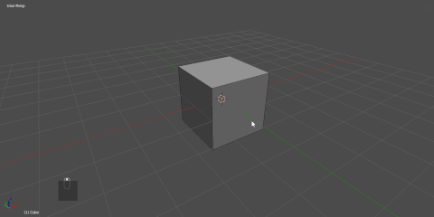

<iframe width="560" height="315" src="https://www.youtube.com/embed/UMnjnBCz-_o" frameborder="0" allowfullscreen></iframe>

> If [Boxcutter](https://gumroad.com/l/BoxCutter) is installed it can be started with Alt + W

---
