### HOPS Modifiers

With the introduction of Hard Ops 0098 a modifier system was added. This allows for procedural creation using hardOps. It was expanded further with the [hopsTool](hopsTool.md)

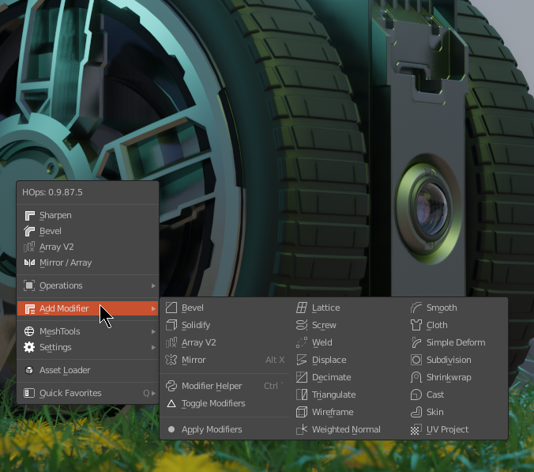

Currently the list has the
  - Bevel
  - Solidify
  - Array
  - Mirror
  - Screw
  - Simple Deform
  - Displace
  - Simple Deform
  - Cast
  - Decimate
  - Weighted Normal
  - Subdivision
  - Triangulate
  - Lattice
  - Shrinkwrap
  - Wireframe
  - Skin

  And then the custom versions of modals modified for hops.
  - 2d Bevelling
  - Spherecast
  - Circular Array

Then apply modifiers. Which does just that.

## Modifiers

# [Bevel](bwidth.md)

See [Bevel](bwidth.md)

Bevel needs no introduction but in case you need one it adds a bevel mod to the mesh which and give a nice rounding or filleting.

During the modal H shows help options.

The bwidth page goes more in depth on the topic.

___

# [Solidify](tthick.md)

See [Solidify](tthick.md)

Solidify also called tThick sometimes for menu reasons will add thickness to the model. It is useful for adding thickness to boolshapes.

There is also a help panel.

[Solidify / Tthick is also useful](tthick.md) for boolean operations.

___

# [Mirror](mirror_symmetry.md)

Mirror brings up the interactive mirror gizmo that offers 3 different ways to mirror.
For more information see [Mirror](mirror_symmetry.md).

[This also has the hotkey alt+X.](hotkeys.md)

Mirror has 3 different options.

- modifier (new to 2.8)
  - mirrors the mesh on the modifier level using bisect
- bisect (classic)
- symmetrize (symmetrize and be done) doesn't leave a modifier behind nor use one

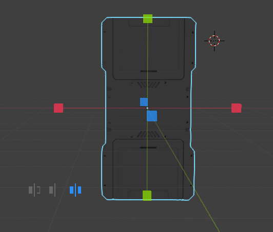

___

# Array

Array will allow users to add or modify an array modifier on an object.

Array also works on multiple objects.

Of course press H for help.

Pressing 2 during the modal will add a 2nd modifier.

___

# Screw

Screw will allow users to add or modify a spin modifier. The spin modifier is interesting because it can be used for a variety of things outside of lathe. By setting the angle to 0 this will behave like an extrude leading to some interesting results in non destructive asset creation.

This is how I use it on planes to make cylinoids.

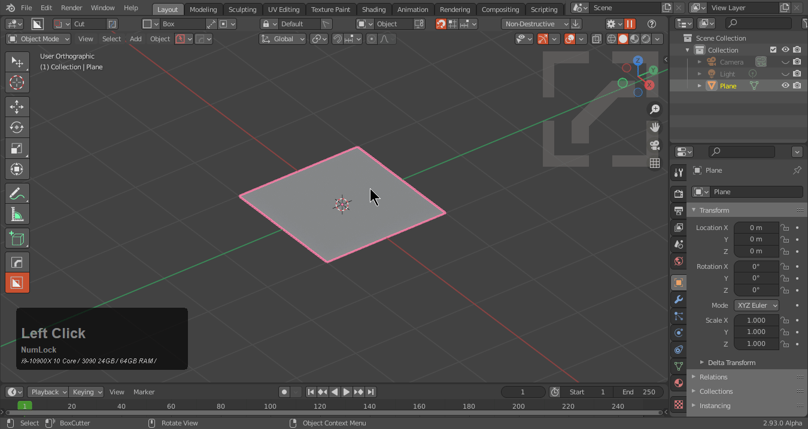

It can also be used in conjuction with displace to create quick springs on the fly.

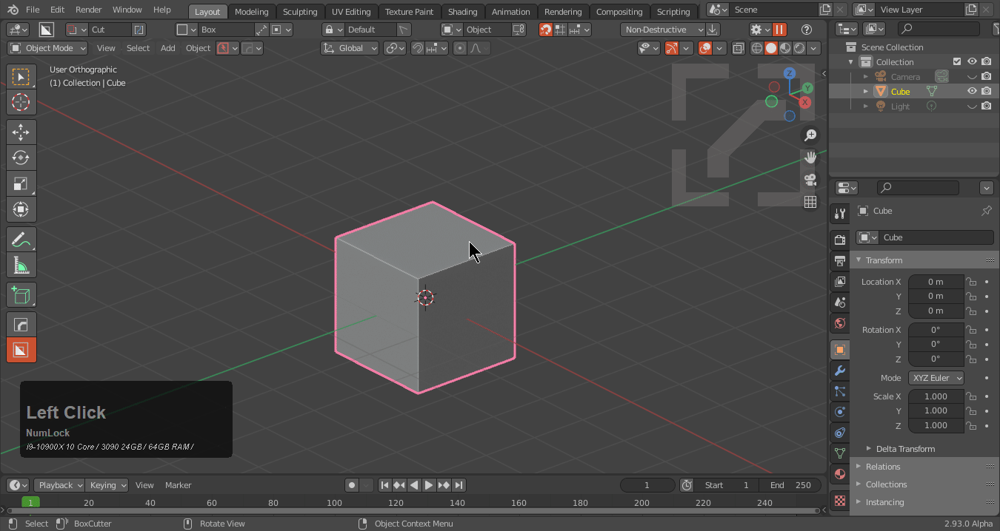

Screw is also a major component in [hopsTool.](hopsTool.md).

Press H for help during the screw modal.

___

# Displace

Adds a displace modifiers on the model. We use in to move geometry while preserving the initial origin point.

It has special uses in conjunction with screw.

It is also a part of the [circular array](circular.md).

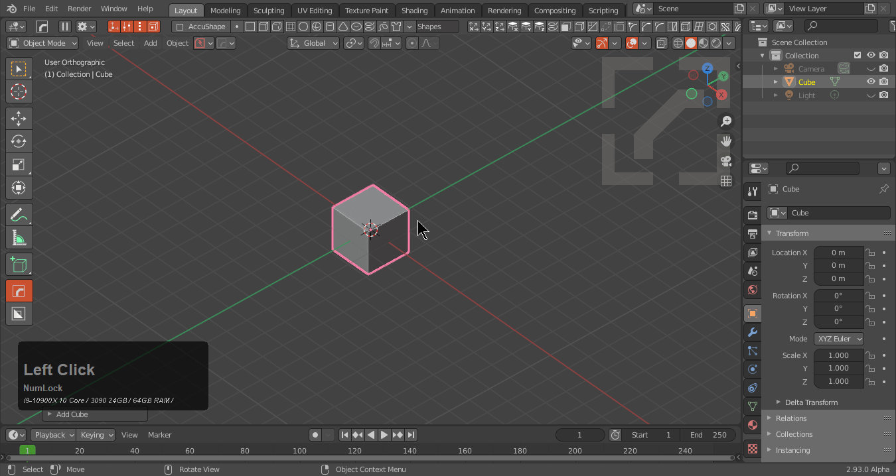

Press H to help.

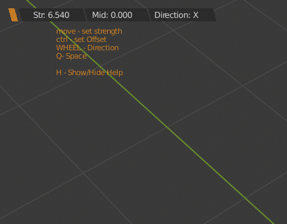

___

# Simple Deform

Adds a simple deform that can be toggled between twist, taper, and deform.

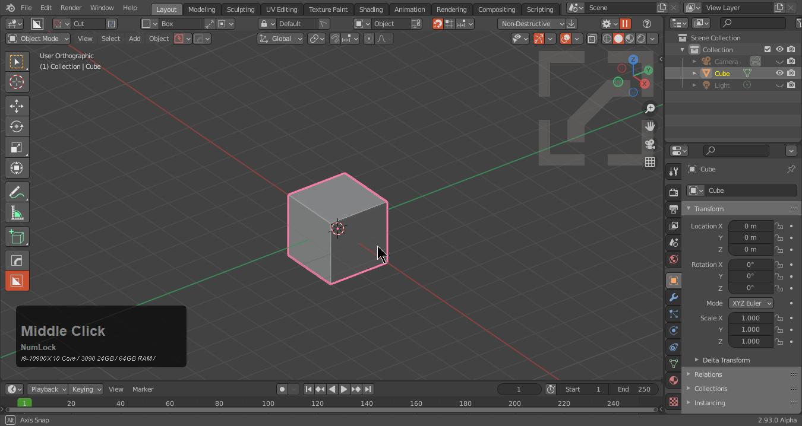

Press H for help.

It makes more sense in [hopsTool.](hopsTool.md).

___

# Cast

Adds or modifies a cast modifier set to sphere, cube or cylinder. Typically I use this on sphere for spherecast.
Users can scroll the wheel to change the result.

Press H for help.

___

# Decimate

Adds a decimate modifier to the mesh. We set this to 5 degrees which results in a non destructive form of clean mesh.

The gif below shows the difference on planar surface. It can be tricky in action and is [recommended to sort wisely.](sorting.md)

Ctrl + click to add an additional one in the modifier stack.

___

# Weighted Normal

Adds a weighted normal modifier to the selected object(s).

In blender shading is always a struggle especially with edgeflows going wild from modifier and boolean based modelling. Weighted normal is generally put at the end of the stack and can be useful for improving shading.

It's subtle in most cases but can be a lifesaver on more complex models.

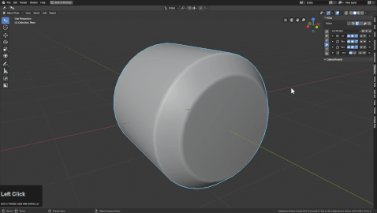

Ctrl + click to add an additional one in the modifier stack.

___

# Subdivision

Adds a subdivision modifier to the selected object(s).

This is similar to ctrl + 1 to add a subdivision modifier.

Ctrl + click to add an additional one in the modifier stack.

___

# Triangulate

Adds a triangulate modifier to the selected object(s).

___

# Lattice

Adds a lattice modifier and lattice to the selected object(s).

This is intended to fit to the bounds of the object so it is unparented in the event adjustments must be made.

Ctrl + click to add an additional one in the modifier stack.

___

# Shrinkwrap

Adds a shrinkwrap modifier to the main object while shrinkwrapping it to the secondary object.

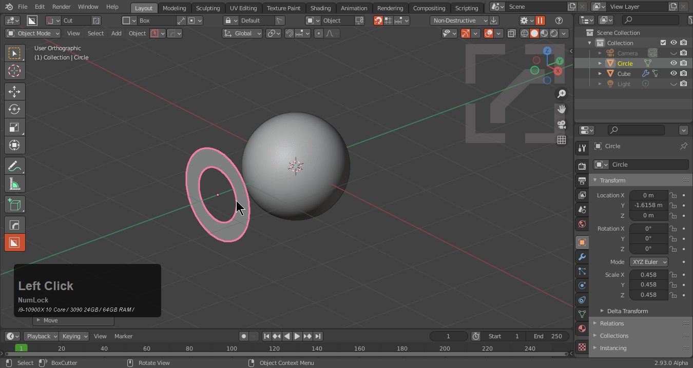

___

# Wireframe

Adds a wireframe modifier to the selected object(s).

___

# Skin

Adds a skin modifier to the selected object(s).

___

## Custom Modifiers

___

# [2d Bevel](2dbevel.md)

[2d Bevel](2dbevel.md) adds a bevel modifier (verts) to the selected object.

This isn't intended for non-2d shapes. See the [2d Bevel](2dbevel.md) page for more info.

It also has a use and button in hopsTool.

___

# Spherecast

Spherecast was made to turn cubes into sphere. When used spherecast does the following things.

- adds a subdivision modifier level 3
- adds a cast modifier(sphere) factor 1

That's all it takes to turn a cube into a sphere.

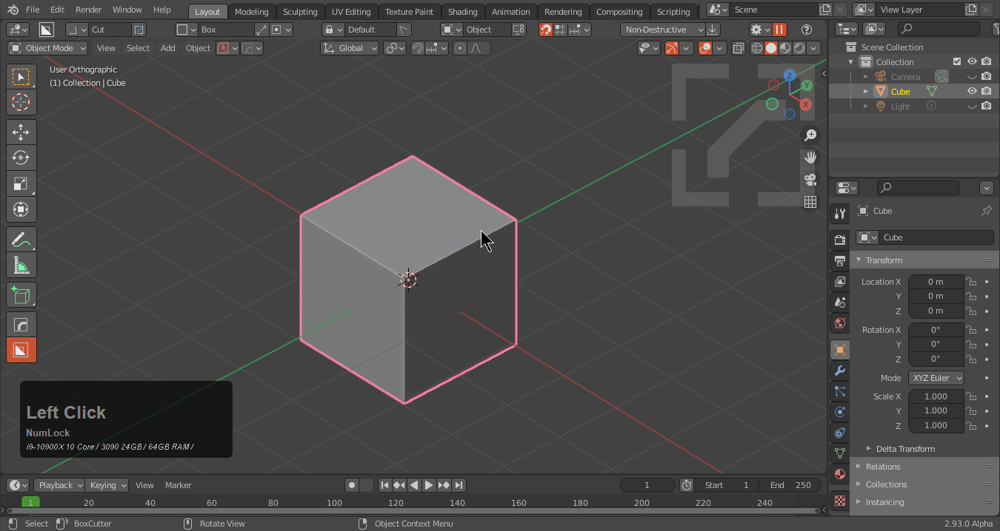

___

# [Circular Array](circular.md)

[Circular Array](circular.md) does the following.

- empty with a driver based off of Array
- displace modifier to push the object outside for radius
- array with offset based off of initial empty

for more details see [Circular Array](circular.md).

Hovering over the option shows alternate creation types.

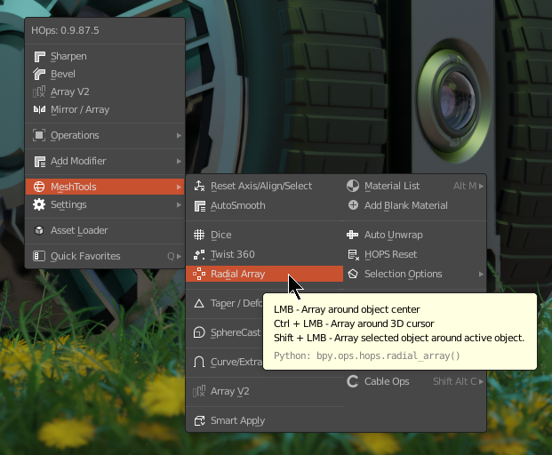

___
