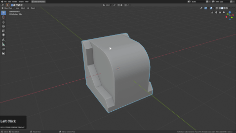
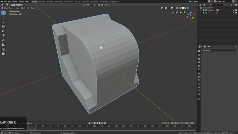
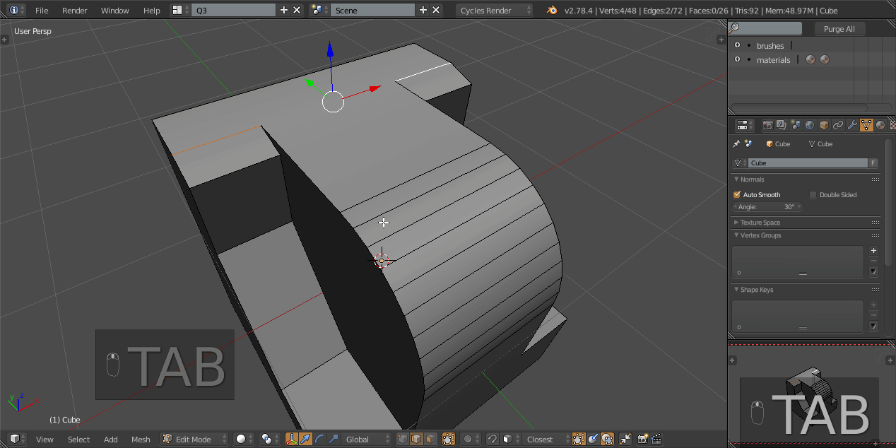
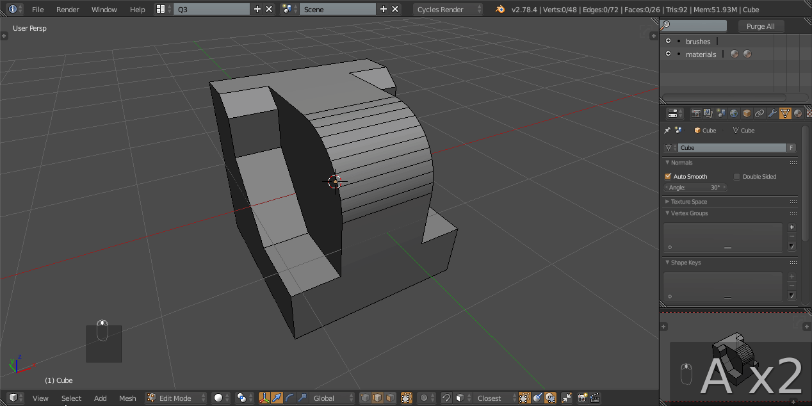
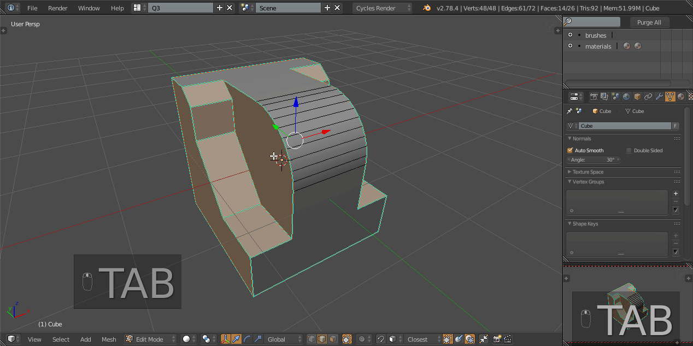
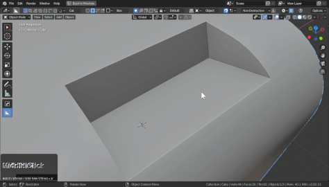
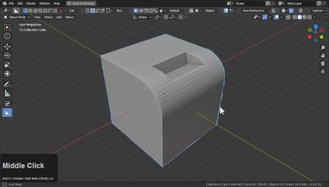
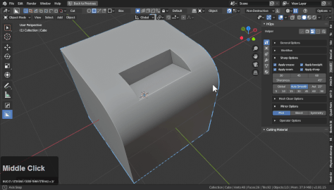

### Understanding Sharpening (Ssharpening)

To best understand [ssharpen](ssharpen.md) / [csharpen](csharpen.md) you must understand what it is to do it manually.

## Example 1 (edge split / alternative)
For the longest time this was my workflow for cleaning up parts of models.

- set smooth
- add edge split modifier

This would resolve the shading enough to get the mesh to look decent. But when I would send the model for rigging they would experience issues with mesh's exploding. The faces were all broken at the 30 degree threshhold, creating a ton of additional geo and points.

This was a workflow I leaned from [BG](http://www.blenderguru.com/) back in the day.

Its important to note that on this object the vertcount went from 63 to 146. This is excessive at times for something that is only shading.

> This workflow is not recommended of course but it's just a part of the history.

## Example 2 (sharp / autosmooth)
This workflow involves using the new auto smooth parameter and not using edge split which improves the shading and keeps the vert count.

After removing edge split and using the autosmooth, the result looks the same. This was added by Blender around the 2.7 era and has been a great addition. This workflow is what we chose to expand on in Hard Ops after the creation of a few additional operators that allowed us to ease the process.

So example 2 works well, in fact it also works in conjunction with marking sharps in the Ctrl + E menu in edit mode.

As time went on it became apparent that even the marking of edges manually was alot of work and could be lessened. So now enter the edit mode sharpening tools.

With the ability to select sharp edge based off of degrees blender's potential improved dramatically for hard surface creation. This was the foundation of the ssharp system. The select menu of hard ops has many functions that are worth experimenting with.

The bevel modifier also can be used intelligently here. By manually marking the sharp edges you can make the bevel modifier only work on areas you specifically want.

This is the foundation for [ssharpen](ssharpen.md) / [csharpen](csharpen.md). To best use these functions it is best to understand how to do it manually.

With this information you should be ready for ssharpen / csharpen which expands on these ideas in an automated fashion.

# Autosmooth Quickprefs

Autosmooth quickprefs can be found in either the hardOps:

- N panel
- HOPS Corner Button
- Ctrl + ~ Helper

Tool >> Sharp Options 

To make the autosmoothing workflow easier we added the ability to quickly choose an smoothing pref.

> In the above example it can be visual how higher autosmooth amounts can cause issues with lesser angles on meshes. 45 and lower works but 60 degrees resulted in shading issues.

The global toggle ensures the autosmooth set by the user is not reset when the ssharpen / csharpen / step operations are performed.

> Notice that with global unchecked the autosmooth set in the previous example remains despite the sharp markings happening on the 30 degree angle.

Autosmooth can be toggled off an on using the toggle button.

> Choosing any autosmooth quick preset will set smooth in addition to turning on autosmooth.
