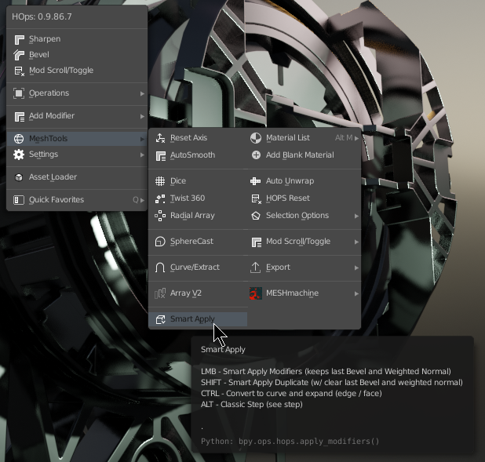
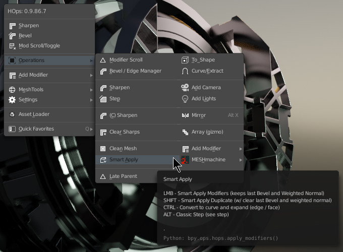
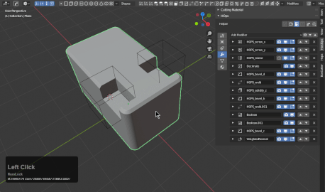
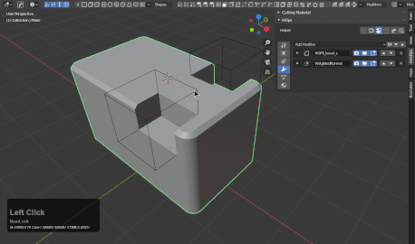
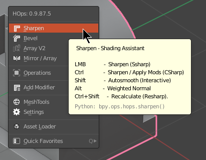
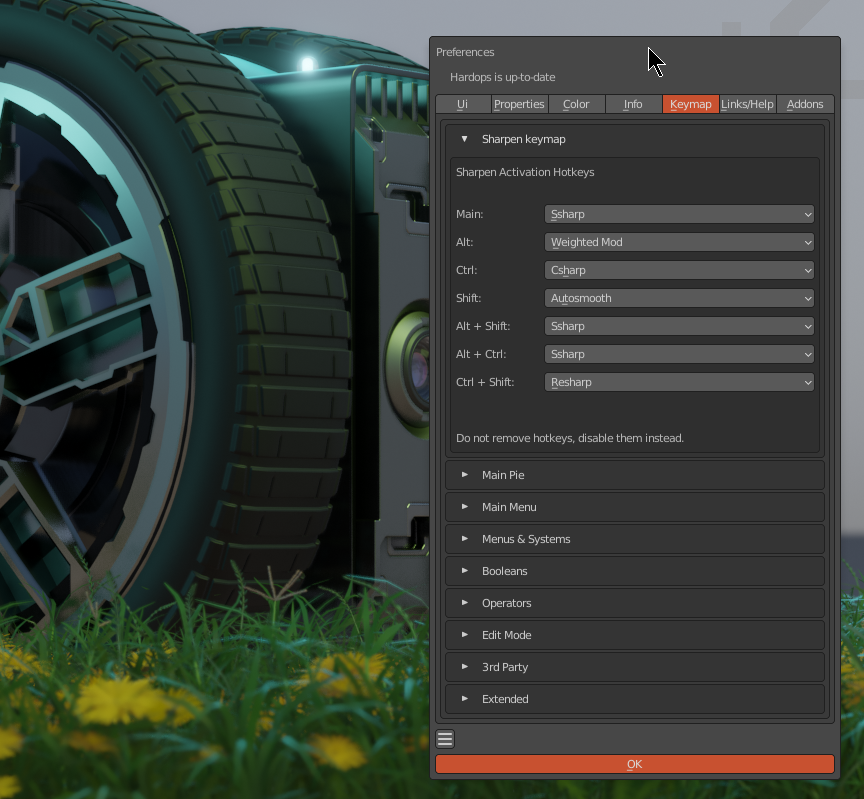

____

# Smart Apply

Smart apply is intended to be our all in one apply / conversion system.

By default it is intended to apply all modifiers except the following:

  - last bevel
  - weighted normal
  - last mirror if more than 1 mirror mod is present

Smart Apply is an expansion on the [csharpen](csharpen.md) workflow and its separation from sharpen.

<iframe width="560" height="315" src="https://www.youtube.com/embed/8k2NGWrKbj4" frameborder="0" allow="accelerometer; autoplay; clipboard-write; encrypted-media; gyroscope; picture-in-picture" allowfullscreen></iframe>
____

# Locating Smart Apply

Smart apply can be found in both [meshtools](meshtools.md) and [operations](operations.md).

_____

# Smart Apply in action

In the below example I use hopstool w/ smart box to add a dynamic box containing many modifiers.

To apply this using ctrl + A >> Visual Geometry to mesh would apply more modifiers than desired.

>> As in creating custom normals that will reflect on the next cut.

Also ctrl + clicking Sharpen (csharp) will not apply the mods necessary to result in a usable object since it is optimized for boolean application primarily.

Smart apply is capable of giving us the result we want.

> last bevel and weighted normal left upapplied making it optimal for more boolean work.

____

# Smart Apply Ctrl + click

Ctrl + click smart apply will convert to curve.

____  

# Smart Apply Advanced

- LMB - General Smart Apply

- CTRL - Convert to curve and expand (2d meshes only)

- SHIFT - Smart apply (remove leftover mods after apply)
  - useful for face extractions
  - removes the leftover mods that are left behind

- ALT - [classic step](step.md)
  - WEIGHT Workflow
    - applies current bevel
    - unmarks bevel weighted edges
    - adds new bevel at half without marking
  - ANGLE Workflow
    - adds new bevel at half of previous bevel
    - applies nothing
    - only adds new bevel

__

# Smart Apply w/ Sharpen

By default sharpen utilizes [csharpen](csharpen.md) as the apply system on Ctrl. This can be changed in Preferences >> Keymap >> Sharpen Options.

Pressing Ctrl + K brings up the keymap for preferences where Sharpen can be reconfigured.

**This DOES NOT update the tooltip at this time.**

> For those who are fans of Smart Apply they could replace csharp with smart apply quite easily. And even save prefs to have that as the default state. Smart apply might take center stage in the future.

> Smart apply does apply mirror by default so that is worth taking into consideration.

___

# The Logic Of Smart Apply

Smart apply is an apply system made of rules. Understanding those rules can make it's usage alot more fluid. 

Modifiers early in the stack will be applied regardless. This is because they are considered integral to the construction and cannot be byassed. This doesn't matter if the mod is a bevel or not.

The only mods up for consideration to not be applied is 
- Bevel (Weight / Angle) at the end of the stack
- Mirror modifiers if more than one is present (one will be applied two will have one be ignored)
- Weighted Normal (we aim to keep this at the end of the stack so it will generally be ignored on all cases)

Smart apply also has the concept of a gate. This means that only the last 4 mods are up for possibility of not being applied. All else will be applied leading up to it. 

These rules have been carefully considered and refined over time with systems and logic to allow for additional flexibility but our primary goal with smart apply is to apply without a single option. This has made smart apply quite simple in use and allows for it's reuse in a plethora of places within the tool. 

