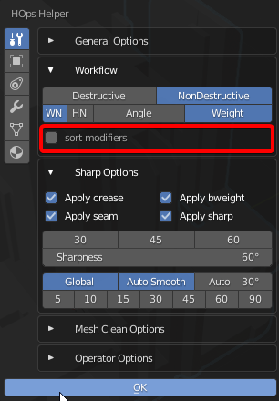
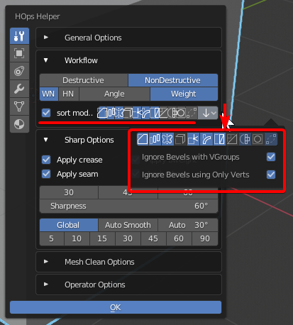
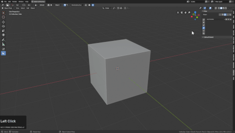
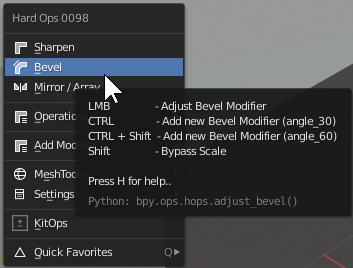
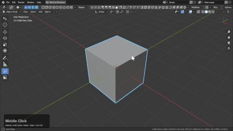
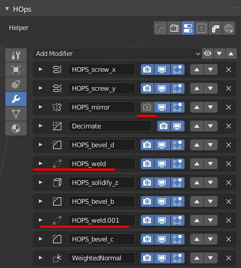

### Sorting workflows in hardOps

# What / Why sort?

Sorting is a new system implemented in HardOps / Boxcutter / Kitops intended to sort modifiers and keep the workflow moving with minimal modifier stack management.

Sorting became possible due to the changes with bevel, mirror and the new weld. With these modifiers improved, the non-destructive workflow was able to be taken much further than before.

> Sort can be turned off in the ctrl + ~ helper of hardops.

# hopsSort

The sort tickbox in hardOps and boxcutter is there for users to specify what modifiers are supposed to be where in the stack post boolean operation. Unchecked modifiers do nothing and remain where there are in the stack.

**clicking them does nothing until the next boolean operation**

[**This only affects boolean operations**](boolean.md)

Sort can be turned off an on overall and the buttons next to it do the following:

- sort bevel modifiers - move bevel mods to bottom of stack
  - non vgroup / only vert mode bevel is left unchanged
- sort array - ensures array is last so it shows booleans in all subparts
- sort mirror - using modifier mirror at the end of the stack will mirror all cuts
- sort solidify - keeps solidify later in the stack. Off by defaults. Only used in certain situations.
- sort weighted normal - keeps weighted normal at the end of the stack (maintains shading)
- sort simple deform - keeps simple deform at the end of the stack before the rest.
- sort triangulate - keeps triangulate after boolean to allow for iterative working on an exportable mesh
- sort decimate - moves decimate at the end of the stack (useful for rare situations)
  - recommended off for smart shapes and situations where the mod order is crucial.
- sort remesh - ensures remesh is kept at the end of the stack
- sort cast - ensures cast is not placed after the boolean modifier
- sort weld (2.82) - ensures weld is kept at the end of the modifier stack.

To show sort bevel in action.

In this example I turned on only bevel sorting. Notice that when I used the boolean operation, the modifier for mirror was put last.

The down pointing arrow is for latest bevel sort. If you have more than one bevel more than likely you only want to deal with the highest level in order to cut with an independent bevel level.

# Sort Last Panel

The sort last panel contains options pertaining to the level of sort being done.

> This panel should never have to be used. Or so we hope. It  exists in case you have to.

As of 984 HOPS will sort only the last version of every mod. This is an upgrade from previous itterations where sort would sort all levels of a sorted mod making work harder.

The latest sort should make sure any mod you have to deal with is minimal and was added to help provide additional supports if needed with multi multi sorting.

# Sort Bypass

Sort can be bypassed by unchecking renderability for a modifier. This is an interim solution for now aimed to make it at least possible to bypass sorting however this will affect the final render so this is best used with consideration for render issues.

Smart box is a good example of this. The mirror mod is disabled for renderability keeping it exempt from sort.

> In the above gif notice that if the mirror is not disabled on sort, the modifier will be moved up the stack changing the overall structure of the smart box itself. By ignoring that mod we can work on it as a form and mirror when it is truly needed.

In action sometimes I will disable sort for the early stack to "freeze" that portion and work on the model with peace of mind of those mods not being disrupted.

## <kbd>Ctrl</kbd> + <kbd>~</kbd> helper

This is how I am able to cut on the final level of a bevel without affecting previous levels.
In this example the bevel angles are as follows.

Hovering over bevel shows the tooltip.

- 30 degrees
- 60 degrees
- 60 degrees

If I use another 30 degree bevel it will detect the previous levels and cause mesh issues and possibly a crash. So this can be a delicate dance.

With mirror sorting the mirror will also be added to the end of the stack ensuring that the modifiers are always ordered in a way to keep working with booleans non destructively.

At the end of the last gif I added a Weighted normal modifier. This mod will always need to be at the end or else shading issues will occur. Turning it on will ensure the mod remains at the end when boolean operations are performed. It is best to turn that on when working with weighted normal.

> Multi- Bevel Sorting video

<iframe width="560" height="315" src="https://www.youtube.com/embed/ZnyMUIilp6g" frameborder="0" allowfullscreen></iframe>

## Sort Gotcha w/ hShapes

Some of the new smart shapes will require certain mods be off in order to maintain stack order.
Lets look at the current smart bbox and scroll through its mods to see how it is made.

The mods on this box are as follows.

As of the latest update in 2.82 the smart box looks like this.

Weld is being used to simplify operations and extend the smart box to work better without shading issues. For that reason 282 or higher is recommended to enjoy smart box to the max.

If we move / toggle the decimate mod this shape will be fundamentally changed. The decimate is needed for simplification and will cause issues.

To show that in action.

This is just to show that all situations can't be handled with sorting and at this time turning off sorting can also be of benefit to users.

Boxcutter also has a sort that must be taken into account. It can be found in either the topbar, n panel or D menu.

We aspire to expand sorting into something more expansive down the road but for now it will have to suffice for boolean operation.

___
