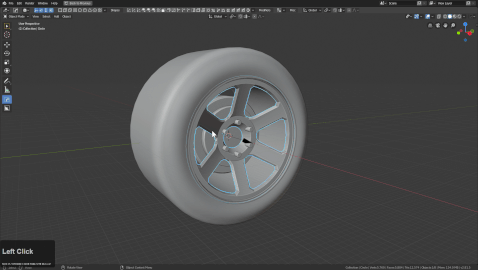
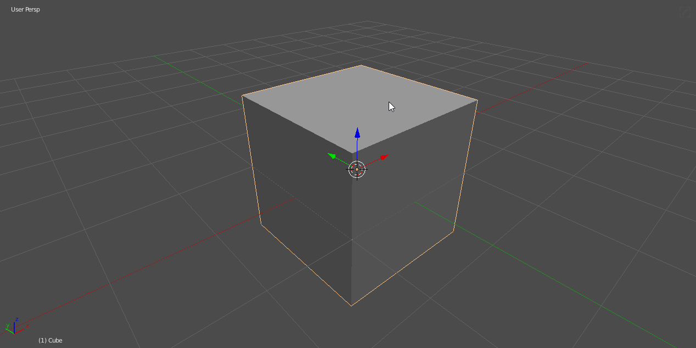
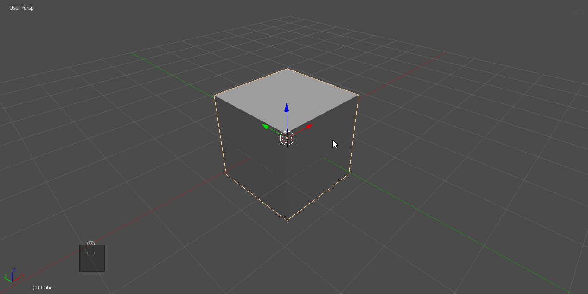
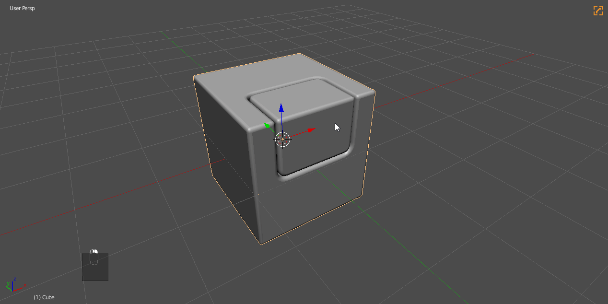
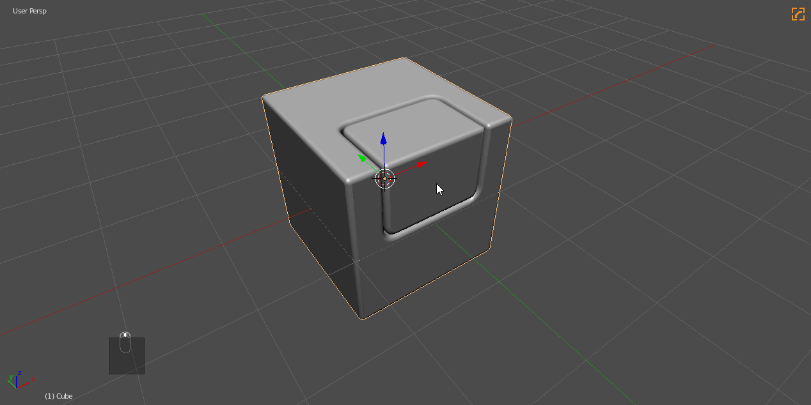

### Sstatus System

Sstatus is how Hard Ops keeps up with objects going through it's workflow. Technically it is just a property we add to meshes as you work but it gets more technical as you begin using operators and their behavior changes to work around you.

Default Meshes are known as undefined. It just means we don't have any exceptions for the mesh since it is not bevelled and possibly not smoothed or sharpened.

---

## Undefined

This is the neutral state of all meshes and the easiest way to tell is the logo in the right hand side of the 3d view. If you don't see one then mesh is not defined in Hard Ops. This isn't a bad thing. It is just important be aware of.

> In the example above I used ssharpen on the mesh which smooths it for HOPS but doesn't change the sstatus. That will not happen until an operator like cSharp is used.

## Csharp

When cSharp is used on a mesh the logo becomes more prominent. This also means the mesh is bevelled and more than likely sharpened. This changes the behavior of some tools but mainly the changes are in the Q menu.

Undefined

- sSharpen (in case smoothing is needed)
- cSharpen (in case smoothing + bevelling is needed)
- tThick (in case thickness needs to be added)

When the mesh changed to Csharp the options changed due to relevance.

- sSharpen (in case the mesh needs to be re-sharpened due to modelling or other changes)
- bWidth (to adjust the bevel width since the mesh is now bevelled)
- step (to bake bevels into the mesh and reset the bevel for future bevelling)

The dynamic menus are the main options that change when going into cSharp state. This is to speedup the ability to make selections from the menu and find options relevant to the users needs. The goal was to create a guided workflow of sorts.

## Cstep

This state means that the mesh has baked bevels and is utilizing hidden boolean behavior. This causes symmetrize (not automirror or mirrror mirror) to hide the mesh in edit mode in between certain operators. This allows for isolated bevelling and a deeper workflow.

> This is considered an advanced option and should be approached with caution and understanding. Misuse can risk hiding meshes and rebevelling bevels.

Cstep once was a function for baking bevels along with sstep. However the workflow has been consolidated and now cstep exists only as an sstate.

> After using step the icon turned blue. This indicated that we baked the bevels and now the modifier is idle until we perform a boolean operation. This can be confusing at first however this system is still being planned out and we plan to add more stypes in the future.

> step was not present in the Q menu in the above example due to the order or operations. I should have stepped the mesh then performed the boolean operation. Going into the operations menu for things is considered an overide but is necessary for certain situations.

## Boolshape

This is a more obscure stype however this is applied to meshes that are used in boolean operations.

When a mesh obtains this sstaus the Q menu for the item will have options for dealing with booleans that are still live.

Below is an example of using it.

The 3 options for boolshapes are:

- bWidth (setting a bevel to the object for rounding the cut)
- tThick (add thickness to the mesh allowing for solid form cutting)
- qArray (clone iteratively via array modifier)

This is based off of the options we most likely use for boolean objects.

---

## Changing sStatus

Sstatus can be changed a variety of ways.

- (CTRL + ~) - HOPS Helper / Misc Tab / Sstatus (change sstatus to anything)

- Q >> Operations >> [Clear sCsharps](clearssharps.md) (changes sstatus to undefined / quick reset)

When using [Clear sCsharps](clearssharps.md) it's important to note this also removed modifiers and sharpening related to HOPS so its a **HARD** override.

Using the (CTRL + ~) - HOPS Helper / Misc Tab / Sstatus is the prefered way to change the Sstatus manually.

---
