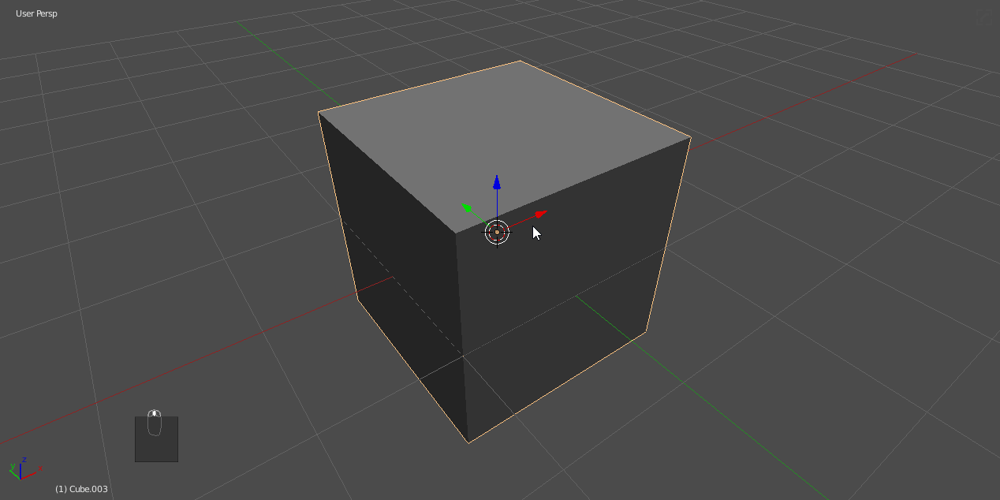
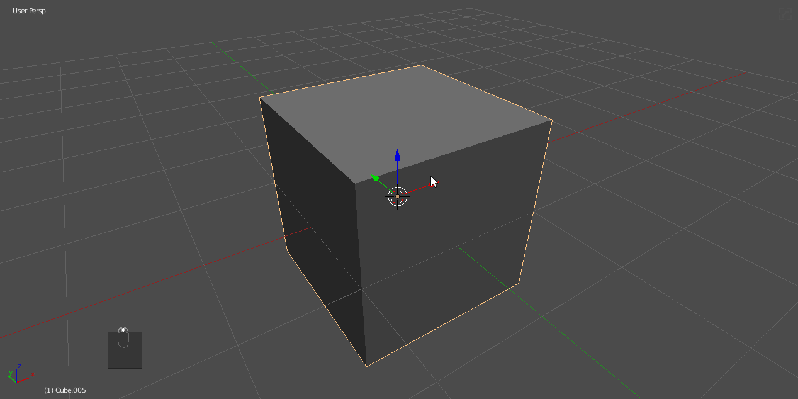
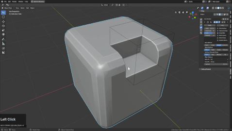

### Step

step is the evolution of the earlier cstep and sstep workflow.

In short, Step will bake the bevels currently on the mesh while adding another bevel modifier. Also the mesh will receive the sstatus Cstep.

This does a few things that might stun users.
Applies the bevels while adding a bevel modifier

This results in the bwidth not responding due to the bevels being applied.

## step use cases

Step is used in situations where you want to apply a larger bevel and begin working in a smaller bevel width. The workflow is always decrementing and is currently only one way.

After using step on the mesh a cube was cut into using the multi select boolean menu in q while also using Csharpen to mark the new area.

In this workflow step bakes and csharp / sharp are used for the same uses they initially have with regular sharpening.

You are also able to keep using to work down to lower and lower levels to continuously detail the object.

## step technical understanding

The way this works is something we call hidden boolean behavior.

When a mesh is hidden and a boolean is applied the mesh visible is only the new mesh created by the boolean modifier. Therefore we are able to isolate and sharpen the mesh after hiding the previous mesh.

This is important to know because in edit mode the mesh will be hidden. To see it press (alt + H).

Also the bevels(if 3 segments) being applied can be caught on regular sharpening if the threshold of the angle is less than 60 without the mesh hidden.

This is important to know because if you have used hard ops this may have happened to you.

Your bevels get bevelled. For this reason the sharp menu in the modifier helper (ctrl + ~) exists.

Changing the angle to 45 or greater will resolve this issue with low segments.

