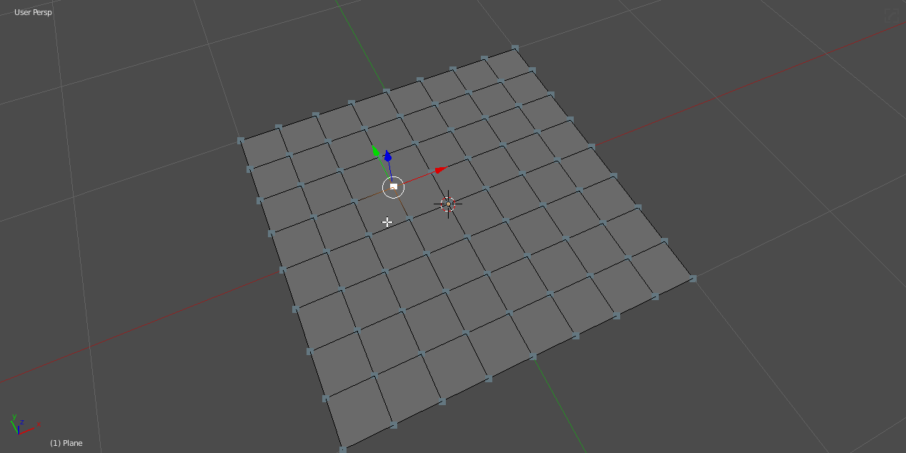
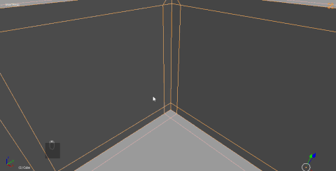
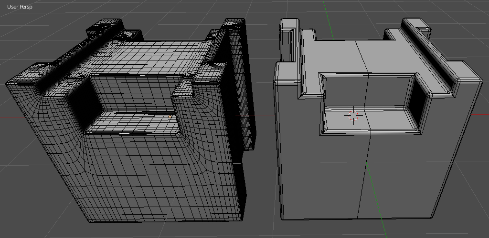
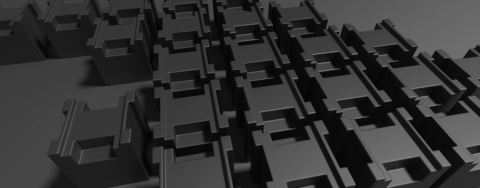

### Booleans And Subdivision

> Subdivision is something I use differently in my work compared to before. While it's usually not present in my final product it is used in the blocking process or in times when I want to exponentially multiply the geometry.

# [How do you make a hardOps mesh work with subdivision?](https://hardops-manual.readthedocs.io/en/latest/faq/#how-do-you-make-a-hardops-mesh-work-with-subdivision)

Below is my classic video for converting from boolean / bevel to subdivison geometry. As you can see it is a process unto itself. This video is a classic from 2.79 so it is still applicable even in the 2.8 era.

<iframe width="560" height="315" src="https://www.youtube.com/embed/f7dvODWS4e4" frameborder="0" allowfullscreen></iframe>

When it comes to more complex assets sometimes I will convert an unbevelled version to the final model as shown here:

<iframe width="560" height="315" src="https://www.youtube.com/embed/UYMrkAOTV9E" frameborder="0" allowfullscreen></iframe>

I don't normally break down game models to all quads since tris also play a role in simplification but the process differs from subdivison conversion. Working smart and using guidance edges can go a long ways in keeping the work ahead minimal.

When I talk about guidance edges I mean this.

> Booleans by default in blender will solve using any edge it can connect to it. And more often than not this is not the desired way to solve a boolean. In the above gif you can see the geometrical hit lessen as go to the edge while face cuts will solve to the nearest corner. Something as simple as adding an edge counteracted this. This edge has only the purpose of guiding the boolean. Therefore it is a guidance edge. That is the only purpose for adding it.

Having less booleans solve with the corners the less stress the bevel modifier will get which reduces the amount of streaking artifacts while working.

With the new miter options on bevel a user could easily build the block in cage from a boolean mesh. And from there make everything quads and be good to go. The bevel mod creates the guidance edges to prevent subdivison from shrinking everything.

a few things to note note:

- bevel was set to profile with 1 by pressing P during bwidth to adjust the profile.
- boxcutter has sorting for bevel on so the bevel is kept on top of the boolean modifiers
- miter spaces out the top of a cut instead of converging them making the subdivision process easier than ever

Also if subdivison is on an object. All is quad. Automatically. So just using subdivision makes and object all quads.

Using triangulate and bevel intelligently can be the difference between adequate shading with subdivison and artifacts due to ngon to subdivision  issues. Even now this object is still able to be modified thanks to [sorting.](sorting.md)

about the above gif:

- bevel is still live but rounded by subdivision.
- triagulate mod via hops will only triangulate ngons which is thanks to enahncements to the modifier itself.
- everything is dynamic but also fully quad once subdivision is brought into play
- during bevel Z turns on wire. This is the object wire. Not to be confused with the viewport wireframe option that had to be toggled in this example

> The flow will not be what you like but it will be all quads.

So the subdivision conversion process can be quite easy depending on geometry and that is built into blender. So exporting to Zbrush and 3dcoat is an option this way as well.

> While working sometimes I will duplicate a portion before progressing forward in order to keep a state I can revert to if I need to add more geometry to the initial mesh or make a large form change. So part of getting the most out of hops is working smart and using the tools Blender has in addition to the tools added with hardOps.

Alternatively users could apply the bevel and clean up the mesh by manually adding loops and that is the most direct way to get a perfect result. However make sure to bevel with a profile of one to create additional edges for managing surfaces. This can come in handy for modelling as well.

In the above example I beveled in edit mode with a profile of 1 to 100% keep the profile but add a spacer loop with low segments. This spacing workflow is essential for maintaining for and controlling flow to master shading with minimal geometry.

___

# 2.79 Subdivision Conversion

To start let's make a simple shape.

Right now with the [cSharpen](csharpen) the shape has a bevel and all the booleans are applied. If we were to put a subdivision modifier on the mesh it would turn into a mess.

We can hack it into place with a triangulate modifier. It's important to note that subdivision on any level will convert a tri/ngons into quads. So sometimes I work on low and just apply sub-d to convert to quads.

But if we do this to our cube it will compromise our edges.

Even raising the segments of the [bWidth](bwidth) will not help this.

So to truly fix this we will need the bwidth and some manual bevels and insets.
In the below example you can notice the following things:

- pressing Z during [bWidth](bwidth) will show wire
- holding <kbd>Ctrl</kbd> and raising profile to 1 has turned this into a subdivision type bevel which we will take advantage of
- the spacing has to not has overlap hence it being a small width

For the next part be on the lookout for the following shape.

These are the bane of the conversion process and must be handled specifically. Due to the angle these edges must be demoted then beveled using <kbd>Ctrl</kbd> + b in edit mode. A few notes about using <kbd>Ctrl</kbd> + <kbd>B</kbd>:

- rolling mouse wheel adds segements
- pressing P allows for profile change. 1 is the value needed here
- F6 will allow custom parameters that will determine the default usage of the next call

With this in mind lets correct the shape. Also I will automirror to make my life easier since this form is an example.

Now the form is set up for us to solve the ngons. The edgework and its edgeflow is the most important thing to me so getting it to flow well no matter what is my goal.

There are tools in Hard Ops for locating ngons and tris which we can use to visually see ngons as they get resolved with the knife.

  - Q >> Settings >> Selection Options >> Display Ngons/Tris

  

First we will apply the bevel which makes everything real and remove the sharpening.

And finally correct everything until red is gone.

And one more to finish it up.

As you can gather by now this process is not easy or automatic and will be dependant on your skill as a modeller. However all quad workflows are possible. For topology I recommend the following [reading](https://www.pinterest.com/sergicg/topology/?lp=true).

Interestingly enough we can convert this back to a simple hops shape with Q >> Operations >> [Clean Mesh(E)](cleanmesh)

So the final question is can you notice the difference?

Even after the normals are weighted and the meshes are rendering?

<iframe width="560" height="315" src="https://www.youtube.com/embed/f7dvODWS4e4" frameborder="0" allowfullscreen></iframe>

---

## Alternate Uses Of Subdivision

# Cylindrical Rebasing

Sometimes I utilize the sharpening / creasing behavior of ssharpen to level up cylindrical shapes for detail.

If subdivision is used on default ngon capped cylinder, the shape collapses. It has always driven me crazy. However with a quick ssharpen the edges are creased at the top allowing me to subdivide and convert to mesh to quickly get back into HOPS workflows.

So to quickly show it in action:

This process is also what we call a rebase. Where the basic form is rounded but the excess spans are removed. Someday we hope to expand on this workflow but for now it is something we experiment with which we figure out automation for the masses.
