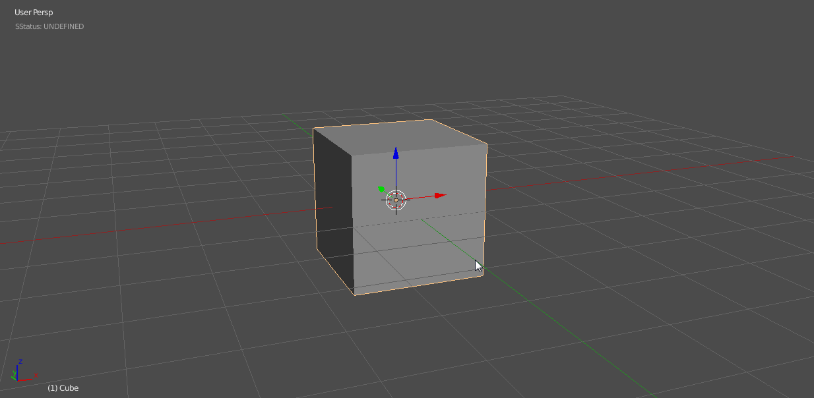

## Hard Ops [Boolean](boolean.md) System

<iframe width="560" height="315" src="https://www.youtube.com/embed/Sd6U4ZFcMyc" frameborder="0" allowfullscreen></iframe>

<iframe width="560" height="315" src="https://www.youtube.com/embed/S6uFpBe1oTU" frameborder="0" allowfullscreen></iframe>

> With 2 meshes selected <kbd>Q</kbd> will bring up the hopsMenu with boolean options.
___

# [Boolean](boolean.md) Basics

> With the Hard Ops 8 update. Booltool is no longer a required dependency. In fact it is recommended to use the new system instead since it's more catered to our own tools. There are also edit mode behaviors now.

**If Booltool is present hardOps not assign our hotkeys.**

The [Boolean](boolean.md) hotkeys are as follows
Object Mode

  - <kbd>Ctrl</kbd> + <kbd>numpad + </kbd> / performs union
  - <kbd>Ctrl</kbd> + <kbd>numpad - </kbd> / performs subtraction
  - <kbd>Ctrl</kbd> + <kbd>numpad * </kbd> / peforms slicing

Edit Mode

  - <kbd>Ctrl</kbd> + <kbd>alt + numpad + </kbd>/ performs union
  - <kbd>Ctrl</kbd> + <kbd>alt + numpad - </kbd>/ performs subtraction

Object Mode

Edit Mode

____

# [Booleans](boolean.md) Cleanup

____

# [Booleans](boolean.md) And Curvature

Curvature can be a tricky thing to use with [Boolean](boolean.md)s and to be honest there is no shortcut to efficient geometry however there are some understandings that can make it easier.

> Using a [Boolean](boolean.md) on a cylinder is the same in Hard Ops as it would be with just [Boolean](boolean.md)s alone.

Here I attempt clean it up the lazy way.

As you can see the geometric result was quite bad. This is due to the surfacing / curves ngons and the bevel on top. There are a couple of ways to fix this.

  -adding geometry around the area to isolate the normal shading. Bevel 2 segment w/ profile at 1.

  -removing doubles for double vertices in the same areas while merging near miss vertices

  This can require a small amount of work however we are always looking into ways to improve this.

  The difference between them can be quite immense.

The art of cleanup is an essential one for boolean modelling. I also recommend [meshMachine](https://www.blendermarket.com/products/MESHmachine) to make this aspect of working much easier.

<iframe width="560" height="315" src="https://www.youtube.com/watch?v=C5TknYySBpM" frameborder="0" allowfullscreen></iframe>

___

# Pokeball example

A nice demonstration of the inadequacies of [Boolean](boolean.md)s for hard surfaces can be shown in making a pokeball. I did a small study about how it can be done quickly with [Boolean](boolean.md)s versus efficiently with a cast modifier and subdivision blocking.

> [Booleans](boolean.md)

You can see with the surfaces that there is still a little touchup work to be done. However I must say that Hard Ops is not just for booleans it also is a tool for helping get a "finished" result. So now lets try using a cast modifier with subdivision to get the shape more sharper.

> Cast Modifier With Subdivision Blocking

In this example the finishing was done via the Bevel while the initial shape is blocked in using modifiers efficiently and the cast modifier. While this can't work in all cases. It just serves as an example of an alternative way to approach such a shape.
