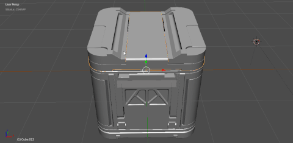
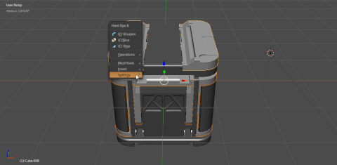
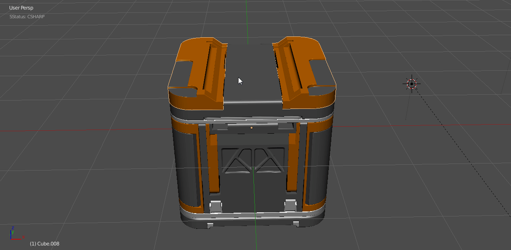

# Material List / Material Helper
___

### How to use the Material List

Q >> Settings >> Material List

> This will display the materials present in the scene. If you have no materials created none will be shown. In my scene I have defaults that I use for quick colorization. This is available per object in object mode and on a geometric seclection via edit mode.

Here is an example of the material menu being used in edit mode.

In this example you can also see how it works in edit mode.

> It's almost important to note that multi materials on the same mesh using geometric separations and bevels will look better with an even number bevel segment amount. You can see this is the above example as well.

___

### Where do you get more materials?

I get my materials from a variety of sources.

- [Disney Ubershader](http://www.onelvxe.com/ubershaderbeta)
- [Metal Pack](http://www.blendswap.com/blends/view/69793)
- [Car Paint](http://www.blendswap.com/blends/view/47497)
- [Ubershader](http://www.blendswap.com/blends/view/56807)
- [Free PBR Material](http://www.blenderbrit.co.uk/free-tool-pbr-node-pack/)
- [PBR Material](https://cgcookiemarkets.com/all-products/pbr-material-node/)
- [Low Noise Pack](https://cgcookiemarkets.com/all-products/low-noise-shader-pack/)

Shaders are beyond the scope of this plugin but these locations should be enough to get you started. These days I use materials more for color blocking and then swap them out for the intended ones after baking or downpacking.

In my default scene I keep a sphere on layer 0 with materials held that allow me to hold some quick preferences. From here I am able to delete the sphere later and only the used materials are kept.

Usually my goal is just a quick presentation render. Similar to this.

<iframe src="https://www.youtube.com/embed/eUQ4HSCYJfg" style="position: absolute; top: 0; left: 0; width: 100%; height: 100%;" allowfullscreen seamless frameBorder="0"></iframe>

___

### How to bring up the Material Helper.

** Ctrl + ~ ** brings up the modifier helper. The 2nd tab is the material helper.

> Currently we still are developing this so there may be some issues however it does exist as an option to experiment with in the meantime. The modifier helper is quite useful for managing modifiers and we hope the material helper will become just as useful.

___

